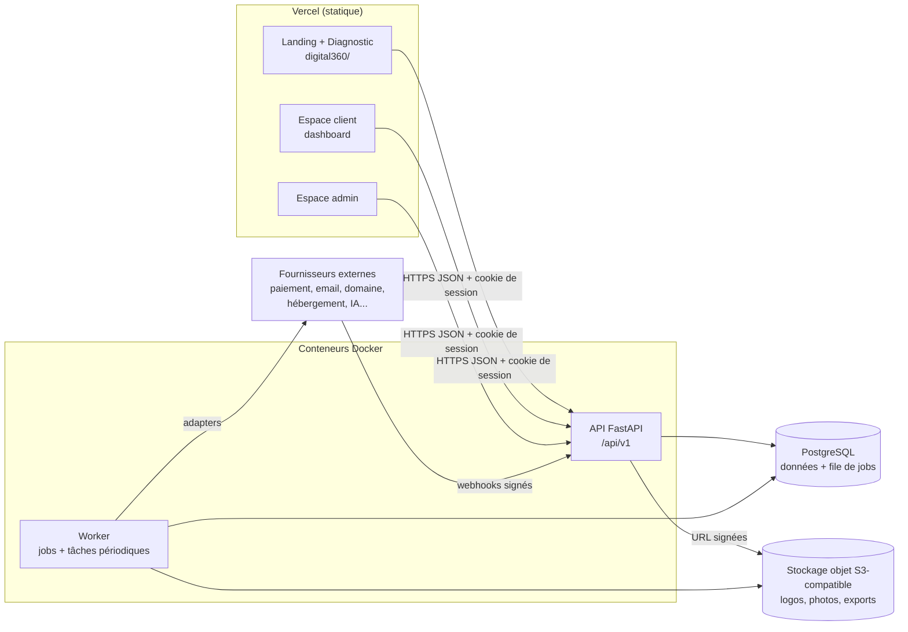
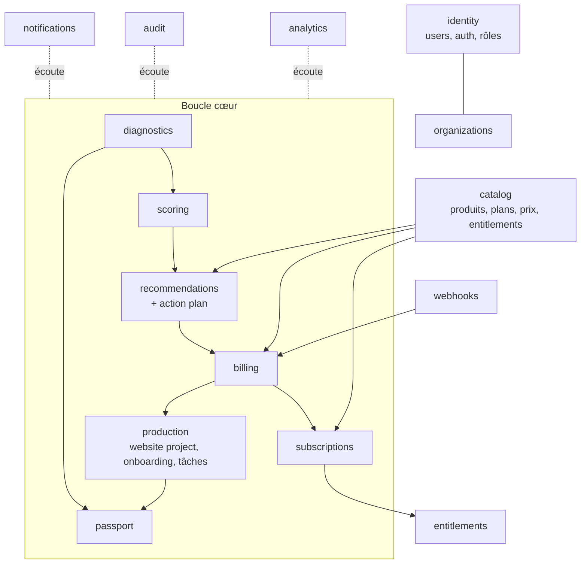
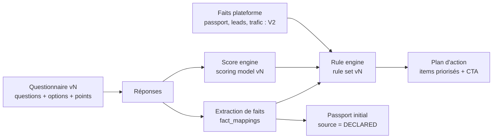
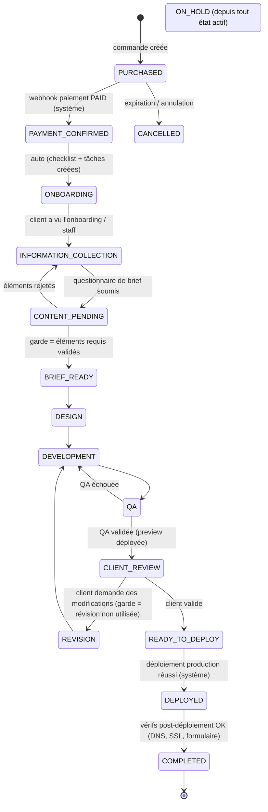
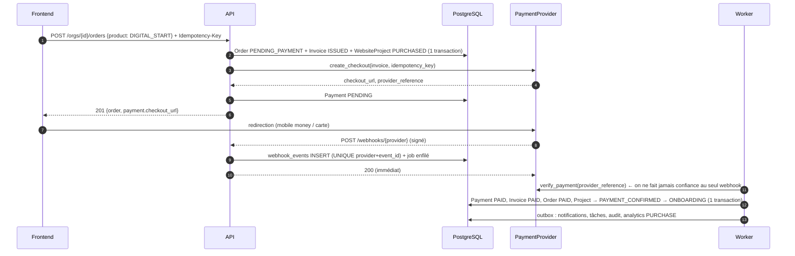
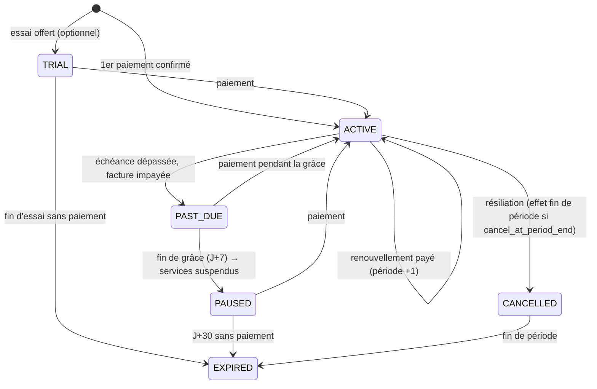

# BENILAB Digital360 — Architecture logicielle (backend, métier, données)

> Document de référence du **moteur** de la plateforme BENILAB Digital360.
> Il couvre l'architecture technique et métier, le modèle de données, les workflows, les contrats d'API, le RBAC, la stratégie multi-tenant, l'abstraction des fournisseurs et la feuille de route.
>
> - Architecture UX/UI (Kilo) : [`../digital360/ARCHITECTURE.md`](../digital360/ARCHITECTURE.md)
> - Propriétaire : BENILAB SARL — Signature : « De votre présence digitale à votre croissance. »
> - Statut : **proposition v1, à valider** avant les migrations définitives (voir §17 Questions ouvertes).

---

## Sommaire

0. [Audit du dépôt existant](#0-audit-du-dépôt-existant)
1. [Principes et décisions structurantes](#1-principes-et-décisions-structurantes)
2. [Architecture technique](#2-architecture-technique)
3. [Architecture métier (bounded contexts)](#3-architecture-métier-bounded-contexts)
4. [Stratégie multi-tenant](#4-stratégie-multi-tenant)
5. [Authentification, rôles et permissions](#5-authentification-rôles-et-permissions)
6. [Modèle de données](#6-modèle-de-données)
7. [Moteurs : diagnostic, score, recommandations, plan](#7-moteurs--diagnostic-score-recommandations-plan)
8. [Catalogue, tarification et entitlements](#8-catalogue-tarification-et-entitlements)
9. [Workflows et machines à états](#9-workflows-et-machines-à-états)
10. [Paiements, facturation, abonnements](#10-paiements-facturation-abonnements)
11. [Abstraction des fournisseurs](#11-abstraction-des-fournisseurs)
12. [Jobs, événements, webhooks, idempotence](#12-jobs-événements-webhooks-idempotence)
13. [Contrats d'API](#13-contrats-dapi)
14. [Sécurité, RGPD, audit, observabilité](#14-sécurité-rgpd-audit-observabilité)
15. [Contrat de collaboration avec Kilo](#15-contrat-de-collaboration-avec-kilo)
16. [Tests, déploiement, variables d'environnement](#16-tests-déploiement-variables-denvironnement)
17. [Questions ouvertes (décisions business)](#17-questions-ouvertes-décisions-business)
18. [Feuille de route MVP / V2 / V3](#18-feuille-de-route-mvp--v2--v3)
19. [Registre des décisions (ADR)](#19-registre-des-décisions-adr)

---

## 0. Audit du dépôt existant

### 0.1 Inventaire

| Élément | Contenu | Nature |
|---|---|---|
| `index.html`, `be-media-ai.html`, `css/styles.css`, `js/main.js` | Site vitrine Be Media AI | Statique |
| `academy360/`, `booster360/` | Landing pages de l'écosystème | Statique |
| `digital360/index.html` (1 196 lignes) | Landing + diagnostic 7 étapes + score + passport + plan, JS inline | Statique + logique côté navigateur |
| `digital360/css/*` (non commité) | Design system et styles dashboard/admin (Kilo) | Frontend en cours |
| `digital360/ARCHITECTURE.md` (non commité) | Sitemap, flows, design system, composants (Kilo) | Doc UX/UI |
| `vercel.json` | Déploiement statique, `outputDirectory: "."`, 3 réécritures de routes | Infra |

Il n'y a **aucun** backend, base de données, `package.json`, `pyproject.toml`, test, pipeline CI ni gestion de secrets.

### 0.2 Ce qui est réutilisable

- **Contenu du questionnaire** (`digital360/index.html` l. 340-700) : environ 15 questions et leurs options (`d-site`, `d-domain`, `d-emailprof`, `d-gb`, `d-reviews`, `d-socials`, `d-ads`, `d-seo`, `d-contact`, `d-booking`, `d-clientbase`, `d-comm`, `d-freq`, `d-producer`, `d-goal`). Ce contenu devient le **seed du questionnaire v1** (§7.1).
- **Barème de `calculateScores()`** : il sert de point de départ au **modèle de score v1**, après correction (§7.2).
- **Phases de `renderPlan()`** (Être présent → Être visible → Attirer → Convertir → Fidéliser) : elles deviennent les **règles de recommandation v1** et le regroupement du plan d'action.
- **Grille tarifaire affichée** : elle est conforme au modèle commercial (89 900 / 25 000 / 50 000 / 100 000 FCFA) et servira de seed du catalogue.
- **Design system et sitemap de Kilo** : ils sont compatibles avec cette architecture. Les routes client/admin de Kilo sont reprises telles quelles dans les contrats d'API (§13).

### 0.3 Défauts constatés

| # | Défaut | Impact | Traitement |
|---|---|---|---|
| A1 | Le diagnostic est stocké dans le `localStorage` et **jamais envoyé** | Tous les leads générés par le diagnostic gratuit sont perdus pour BENILAB | API `/public/diagnostics` (MVP, priorité 1) |
| A2 | `renderPlan()` : `need: !diagData['d-domain']`. La valeur `'non'` est vraie en JS, donc « Nom de domaine » s'affiche comme actif pour un client qui n'en a pas | Plan faux | Le plan est calculé côté serveur par le moteur de règles |
| A3 | Libellé corrompu `'Bonne基础 digitale'` (caractères chinois) | Image de marque | Les niveaux de maturité deviennent configurables (§7.2) |
| A4 | Score : le site compte dans 3 catégories, `20 × nb_réseaux`, plafonds `min(100)` arbitraires, moyenne non pondérée | Score peu discriminant et non explicable | Normalisation par score maximal possible et poids configurables |
| A5 | Questions, barème, libellés et prix sont codés en dur dans le HTML | Contraire aux règles §10 et §58 du cahier des charges | Configuration versionnée en base, servie par l'API |
| A6 | Le document Kilo annonce 8 étapes, le code en a 7 | Incohérence | Le nombre d'étapes découle du questionnaire publié (API) |
| A7 | `vercel.json` : sans `{"handle":"filesystem"}`, la règle `/digital360/(.*)` → `index.html` réécrit **aussi** `/digital360/css/*.css` et `/digital360/js/*.js` | Les nouveaux fichiers CSS/JS de Kilo seront servis comme du HTML | Ajouter `{ "handle": "filesystem" }` en tête de `routes` (à vérifier sur un déploiement preview) |
| A8 | `outputDirectory: "."` et déploiement via la CLI (`.vercel/project.json`) : **tout le dossier local est publié**, y compris `platform/`, `.omc/` et tout futur `.env` | Fuite de code et de secrets | Ajouter un `.vercelignore` (`platform/`, `.omc/`, `*.md`, `.env*`) **avant** d'ajouter du code backend |
| A9 | Déploiement sur `*.vercel.app` : ce domaine est sur la *Public Suffix List*, donc aucun cookie ne peut être partagé entre sous-domaines, et un appel vers une API sur un autre domaine devient cross-site | Authentification par cookie impossible en l'état | Domaine propre (ex. `benilab360.com`) pour le frontend et l'API (§16.2) |

### 0.4 Conclusion de l'audit

Aucune logique serveur n'existe, donc rien à migrer côté backend. La plateforme est construite **à côté** du frontend existant, dans un dossier `platform/` exclu du déploiement statique. Seules deux modifications touchent l'existant : les corrections de `vercel.json` (A7, A8) et, côté Kilo, le remplacement de la logique locale du diagnostic par des appels API (§15).

---

## 1. Principes et décisions structurantes

| Décision | Choix | Pourquoi / compromis |
|---|---|---|
| Style d'architecture | **Monolithe modulaire** (un déployable API et un déployable worker, même codebase) | Une petite équipe ne peut pas opérer des microservices. Des modules isolés par bounded context, avec des frontières explicites, permettent d'en extraire un plus tard si la charge l'exige. |
| Langage backend | **Python 3.12 + FastAPI** | Stack principale de l'équipe. Pydantic v2 génère un OpenAPI strict qui sert de contrat pour Kilo. Compromis : pas de types partagés natifs avec le frontend, compensé par la génération des types depuis OpenAPI (§15). |
| Base de données | **PostgreSQL 16** | Relationnel (facturation, workflows), JSONB pour les données semi-structurées (réponses, contenus de pages), RLS pour l'isolation des tenants, partitionnement pour l'analytics. |
| ORM / migrations | **SQLAlchemy 2 (async) + Alembic** | Standard Python, migrations versionnées. |
| Jobs asynchrones | **File de jobs maison sur PostgreSQL** (table `jobs`, `FOR UPDATE SKIP LOCKED`, `core/jobs.py`) | Un composant d'infra en moins pour le MVP. L'enfilement se fait **dans la même transaction** que l'écriture métier (outbox), sur la même connexion SQLAlchemy, avec retries, délai croissant et état `DEAD`. Compromis : débit plus faible que Redis, largement suffisant jusqu'à plusieurs milliers de clients. Voir ADR-004. |
| Configuration métier | **En base, versionnée**, initialisée depuis des fichiers YAML du dépôt (`platform/config/seeds/`) | Questions, barèmes, règles, prix et entitlements évoluent sans redéploiement. Chaque diagnostic référence la version utilisée, donc les résultats restent reproductibles. |
| Intégrations | **Ports / adapters** (interfaces `Protocol`) avec un adapter `Fake` obligatoire pour chaque port | Aucune dépendance définitive à un fournisseur. Les tests et l'E2E tournent sans réseau. |
| Montants | **Entiers en unité mineure + code ISO 4217** (`89900 XOF`, `13705 EUR` = 137,05 €) | Trois devises (XOF, XAF, EUR) : XOF et XAF n'ont pas de décimales, l'EUR en a deux. Stocker des unités mineures entières couvre les trois cas et évite les erreurs d'arrondi des flottants. |
| Devises et prix | **Un prix explicite par devise dans le catalogue, pas de conversion automatique.** Chaque organisation a une devise de facturation fixe. | Des prix ronds dans chaque devise (pas de 137,05 €). Chaque facture est dans une seule devise, ce qui simplifie la comptabilité. |
| Taxes | **Prix catalogue HT**, TVA calculée à la facturation selon le pays de facturation | Décision BENILAB. Les taux sont configurables par pays et ne sont jamais codés en dur. |

**Règle d'or : la logique métier vit exclusivement côté serveur.** Le frontend affiche, collecte et appelle l'API. Il ne calcule ni score, ni prix, ni droits.

---

## 2. Architecture technique

### 2.1 Vue d'ensemble



### 2.2 Organisation du code

```
platform/
├── ARCHITECTURE.md              ← ce document
├── README.md
├── pyproject.toml               black, ruff, mypy, pytest
├── Dockerfile                   multi-stage (builder → runtime slim)
├── docker-compose.yml           api, worker, postgres, minio (dev)
├── .env.example
├── alembic/                     migrations versionnées
├── config/seeds/                questionnaire, scoring, règles, catalogue, templates (YAML)
├── src/digital360/
│   ├── main.py                  création de l'app FastAPI, montage des routers
│   ├── worker.py                point d'entrée du worker
│   ├── core/                    transverse, sans logique métier
│   │   ├── config.py            Settings (pydantic-settings, lit .env)
│   │   ├── db.py                engine, session, contexte tenant (SET LOCAL)
│   │   ├── security.py          hash Argon2id, sessions, CSRF
│   │   ├── tenancy.py           TenantContext, dépendances FastAPI
│   │   ├── permissions.py       RBAC : rôles → permissions, require()
│   │   ├── state_machine.py     moteur générique de transitions
│   │   ├── rules.py             évaluateur de conditions JSON (sans eval)
│   │   ├── events.py            événements de domaine + outbox
│   │   ├── errors.py            erreurs métier → problem+json
│   │   ├── money.py             Money(amount:int, currency:str)
│   │   ├── pagination.py        pagination par curseur
│   │   └── logging.py           logs JSON structurés, request_id
│   ├── modules/                 un dossier par bounded context
│   │   └── <module>/
│   │       ├── domain/          entités, value objects, règles pures (sans I/O)
│   │       ├── application/     services / cas d'usage, ports utilisés
│   │       ├── infrastructure/  modèles SQLAlchemy, repositories
│   │       └── api/             routers FastAPI, schémas Pydantic (DTO)
│   ├── integrations/            adapters fournisseurs, un sous-dossier par port
│   │   └── payments/  base.py (Protocol) · fake.py · <provider>.py
│   └── jobs/                    définition des jobs (appellent les services)
└── tests/  unit/ · integration/ · security/ · e2e/
```

**Règles de dépendance (vérifiées en CI avec `import-linter`) :**

- `domain` n'importe rien d'autre que la stdlib et `core.money`/`core.rules`.
- `application` dépend de `domain` et des **ports**, jamais d'un adapter concret.
- Un module n'accède **jamais** aux tables d'un autre module. Il passe par le service applicatif de ce module ou par un événement de domaine.
- `api` et `jobs` sont des points d'entrée fins qui appellent `application`.

Correspondance avec la règle §50 du cahier des charges : DOMAIN = `domain/`, APPLICATION = `application/`, INFRASTRUCTURE = `infrastructure/` + `core/db`, API = `api/`, WORKERS = `jobs/` + `worker.py`, INTEGRATIONS = `integrations/`.

---

## 3. Architecture métier (bounded contexts)



| Module | Responsabilité | Phase |
|---|---|---|
| `identity` | Utilisateurs, authentification, sessions, rôles staff, **appartenances aux organisations** (contrôle d'accès), invitations | MVP |
| `organizations` | Entreprises clientes (racine du tenant), établissements (plus tard). Dépend d'`identity`, jamais l'inverse (vérifié par `import-linter`) | MVP |
| `diagnostics` | Questionnaires versionnés, sessions anonymes ou rattachées, réponses, extraction de faits | MVP |
| `scoring` | Modèles de score versionnés, calcul pur, snapshots | MVP |
| `recommendations` | Règles configurables, plan d'action | MVP |
| `passport` | État digital consolidé de l'entreprise | MVP |
| `catalog` | Produits, plans, prix versionnés, définitions d'entitlements | MVP |
| `billing` | Commandes, factures, paiements, intégration fournisseurs | MVP |
| `subscriptions` | Cycle de vie des abonnements, renouvellement, relances | MVP |
| `entitlements` | Résolution des droits d'une organisation | MVP |
| `production` | Projets de site, checklist de contenus, templates, tâches internes, déploiements | MVP |
| `notifications` | In-app + email transactionnel, préférences | MVP |
| `audit` | Journal d'audit append-only | MVP |
| `webhooks` | Réception, validation, journal, dispatch | MVP |
| `analytics` | Événements métier (MVP), événements web (V2) | MVP partiel |
| `support` | Tickets | V2 (début) |
| `google_business`, `social`, `content`, `crm` | Visibilité et prospects | V2 |
| `ads`, `email_marketing`, `automation`, `conversion` | Acquisition, conversion, fidélisation | V3 |

La **boucle cœur** (cahier des charges §59) est entièrement couverte par les modules MVP. Les modules V2 et V3 s'y branchent par événements (`WebsiteDeployed`, `SubscriptionActivated`, `LeadCreated`…) et par entitlements, sans modifier le cœur.

---

## 4. Stratégie multi-tenant

**Modèle retenu : base partagée, schéma partagé, colonne `organization_id` sur chaque table tenant, avec une double barrière.**

1. **Barrière applicative (principale)**
   - Toute route client est de la forme `/api/v1/orgs/{org_id}/...`. La dépendance `get_tenant_context()` vérifie que l'utilisateur a une `Membership` active sur `org_id` et construit un `TenantContext(org_id, user_id, role)`.
   - Les repositories tenant héritent de `TenantScopedRepository`, dont toutes les requêtes exigent un `TenantContext`. Il n'existe pas de méthode `get(id)` sans organisation.
   - Une ressource d'une autre organisation renvoie **404** (et non 403), pour ne pas révéler son existence.

2. **Barrière base de données (défense en profondeur) : PostgreSQL Row Level Security**
   - Chaque table tenant a une politique `USING (organization_id = current_setting('app.current_org_id')::uuid)`.
   - Chaque transaction tenant pose `app.current_org_id` via `set_config(..., true)` : la variable disparaît à la fin de la transaction, aucune connexion du pool ne garde de contexte. Sans variable posée, une table tenant ne renvoie **aucune** ligne (fermeture par défaut).
   - La RLS est **forcée** (`FORCE ROW LEVEL SECURITY`) : elle s'applique aussi au propriétaire des tables, donc au rôle applicatif unique. Ce rôle doit être **non superuser et sans BYPASSRLS** (un superuser ignore toute politique) : `/health/ready` refuse le trafic sinon.
   - Les accès staff multi-tenants posent `app.scope = 'staff'` (`staff_transaction`), uniquement depuis les routes `/admin/*` et les jobs, et sont **toujours audités**. Voir ADR-011.

3. **Tests de sécurité systématiques** (§16.1) : un test paramétré parcourt **toutes** les routes `/orgs/{org_id}/...` et vérifie qu'un utilisateur de l'organisation B reçoit 404 sur toute ressource de l'organisation A.

**Pourquoi pas un schéma ou une base par tenant ?** Avec des centaines ou milliers de TPE aux volumes faibles, un schéma par tenant multiplie les migrations et les connexions sans bénéfice réel. Le modèle partagé avec RLS offre une isolation forte pour un coût opérationnel minimal. Un gros client pourra être isolé plus tard si nécessaire.

**Hiérarchie :** `User` ↔ `Membership` ↔ `Organization` → `DigitalPassport`, `Subscriptions`, `WebsiteProjects`, `Leads`, etc. Un utilisateur peut appartenir à plusieurs organisations (un gérant avec deux commerces). Les **établissements** multiples (§8 du cahier des charges) sont prévus via une table `locations` (V2), sans impact sur la clé tenant.

**Cas du diagnostic anonyme :** avant inscription, une `DiagnosticSession` n'a pas d'`organization_id`. Elle est identifiée par un jeton aléatoire (seul son hash est stocké). À l'inscription, l'appel `claim` rattache la session à la nouvelle organisation, crée le Passport initial et le plan d'action.

---

## 5. Authentification, rôles et permissions

### 5.1 Authentification

- **Sessions serveur** stockées en base (table `sessions`), cookie `HttpOnly; Secure; SameSite=Lax`, domaine parent commun (`.benilab360.com`). Rotation de l'identifiant à la connexion, expiration glissante (7 jours) et absolue (30 jours).
  - *Pourquoi pas de JWT* : le frontend est first-party. Les sessions serveur sont révocables immédiatement (changement de rôle, départ d'un employé) et ne laissent aucun jeton exploitable dans le `localStorage`.
- Mots de passe hashés en **Argon2id**. Vérification du mot de passe et **code OTP par email** en option (V2 : OTP WhatsApp ou SMS, très utilisés sur la cible).
- Protection **CSRF** par double cookie : `GET /auth/csrf` pose un cookie `csrf_token` lisible par le JavaScript et renvoie sa valeur ; toute requête non sûre renvoie cette valeur dans l'en-tête `X-CSRF-Token`, comparée au cookie. Rotation du jeton à la connexion. Mécanisme retenu parce que le client de Kilo l'implémentait déjà.
- Réinitialisation du mot de passe par lien à usage unique (hash stocké, expiration 30 min).
- Rate limiting sur `/auth/*` (voir §14.1).

### 5.2 Rôles

Deux familles de rôles, portées par deux tables distinctes pour que l'accès client ne puisse jamais s'élever en accès staff :

| Rôle | Porté par | Périmètre |
|---|---|---|
| `CLIENT_OWNER` | `memberships` | Son organisation : tout, y compris facturation et invitations |
| `CLIENT_MEMBER` | `memberships` | Son organisation : lecture, validation des contenus, tickets (pas de facturation) |
| `ADMIN` | `staff_roles` | Toute la plateforme, paramètres, rôles |
| `MANAGER` | `staff_roles` | Opérations clients, projets, affectation des tâches |
| `CONTENT_MANAGER` | `staff_roles` | Contenus et calendrier éditorial (V2), checklist de contenus |
| `DEVELOPER` | `staff_roles` | Projets de site, déploiements, domaines, hébergement |
| `FINANCE` | `staff_roles` | Paiements, factures, abonnements, remboursements |

Le rôle `CLIENT` du cahier des charges est scindé en `OWNER` et `MEMBER`, pour que le gérant puisse inviter un employé sans lui ouvrir la facturation.

### 5.3 Permissions (RBAC)

Le code ne teste **jamais un rôle** : il teste une **permission** (`require("website_project:transition")`). La table rôle → permissions vit dans `core/permissions.py`, avec un seul endroit à modifier. Extrait de la matrice MVP (C = OWNER, M = MEMBER) :

| Permission | C | M | ADMIN | MANAGER | CONTENT | DEV | FINANCE |
|---|:-:|:-:|:-:|:-:|:-:|:-:|:-:|
| `organization:read` | x | x | x | x | x | x | x |
| `organization:update` | x | | x | x | | | |
| `membership:manage` | x | | x | | | | |
| `diagnostic:read` | x | x | x | x | x | x | |
| `passport:read` | x | x | x | x | x | x | |
| `passport:update` | | | x | x | x | x | |
| `order:create` | x | | x | x | | | |
| `invoice:read` | x | | x | x | | | x |
| `payment:refund` | | | x | | | | x |
| `subscription:manage` | x | | x | x | | | x |
| `website_project:read` | x | x | x | x | x | x | |
| `website_project:transition` | (1) | | x | x | | x | |
| `checklist:submit` | x | x | x | x | x | | |
| `deployment:execute` | | | x | | | x | |
| `task:manage` | | | x | x | x | x | |
| `staff:manage` | | | x | | | | |
| `audit:read` | | | x | | | | |
| `config:manage` (questionnaire, règles, prix) | | | x | | | | |

(1) Le client ne déclenche que les transitions qui lui reviennent : `CLIENT_REVIEW → REVISION` et `CLIENT_REVIEW → READY_TO_DEPLOY` (validation). Chaque transition de la machine à états déclare les permissions autorisées (§9.1).

Les permissions client sont toujours évaluées **dans** le `TenantContext`. Les permissions staff donnent accès aux routes `/admin/*` et, via elles, aux ressources de toutes les organisations.

---

## 6. Modèle de données

### 6.1 Conventions

- Clés primaires `uuid` (v7, triables dans le temps), générées côté application.
- `created_at`, `updated_at` (`timestamptz`) sur toutes les tables. `deleted_at` uniquement là où la suppression douce est justifiée (organisations, utilisateurs).
- Toute table tenant porte `organization_id uuid NOT NULL` avec FK, un index en **première colonne** des index composites, et une politique RLS.
- Statuts : type `text` + contrainte `CHECK`, plutôt qu'un `ENUM` Postgres, car ajouter une valeur ne demande alors qu'une migration triviale et réversible. Les listes de valeurs vivent dans le code (`StrEnum`).
- Montants : `amount bigint` en unité mineure + `currency char(3)` (`CHECK currency IN ('XOF','XAF','EUR')`). L'exposant de chaque devise (0 pour XOF et XAF, 2 pour EUR) est défini dans `core/money.py`. Toute opération entre deux devises différentes lève une erreur.
- Données semi-structurées : `jsonb`, validé par un schéma Pydantic à l'écriture.

### 6.2 Diagramme des relations (MVP)

```mermaid
erDiagram
    USER ||--o{ MEMBERSHIP : "a"
    ORGANIZATION ||--o{ MEMBERSHIP : "a"
    USER ||--o{ STAFF_ROLE : "a"
    USER ||--o{ SESSION : "a"

    QUESTIONNAIRE_VERSION ||--o{ QUESTION : contient
    QUESTION ||--o{ QUESTION_OPTION : propose
    QUESTIONNAIRE_VERSION ||--o{ DIAGNOSTIC_SESSION : "utilisée par"
    ORGANIZATION |o--o{ DIAGNOSTIC_SESSION : "rattachée (après claim)"
    DIAGNOSTIC_SESSION ||--o{ DIAGNOSTIC_ANSWER : contient
    DIAGNOSTIC_SESSION ||--|| DIGITAL_SCORE : produit
    SCORING_MODEL_VERSION ||--o{ DIGITAL_SCORE : "calculé avec"
    DIAGNOSTIC_SESSION ||--o| ACTION_PLAN : produit
    RULE_SET_VERSION ||--o{ ACTION_PLAN : "généré avec"
    ACTION_PLAN ||--o{ ACTION_PLAN_ITEM : contient

    ORGANIZATION ||--|| DIGITAL_PASSPORT : possède
    DIGITAL_PASSPORT ||--o{ PASSPORT_ITEM : contient

    PRODUCT ||--o{ PRICE : "tarifé par"
    PRODUCT ||--o{ PRODUCT_ENTITLEMENT : accorde
    ENTITLEMENT_DEFINITION ||--o{ PRODUCT_ENTITLEMENT : "définit"

    ORGANIZATION ||--o{ ORDER : passe
    ORDER ||--o{ ORDER_ITEM : contient
    ORDER ||--o{ INVOICE : "facturée par"
    INVOICE ||--o{ INVOICE_ITEM : contient
    INVOICE ||--o{ PAYMENT : "réglée par"
    ORGANIZATION ||--o{ SUBSCRIPTION : souscrit
    SUBSCRIPTION ||--o{ INVOICE : "renouvelée par"
    ORGANIZATION ||--o{ ENTITLEMENT_OVERRIDE : "a"

    ORGANIZATION ||--o{ WEBSITE_PROJECT : "a"
    ORDER ||--o| WEBSITE_PROJECT : déclenche
    WEBSITE_TEMPLATE ||--o{ WEBSITE_PROJECT : "base de"
    WEBSITE_PROJECT ||--o{ WEBSITE_PAGE : contient
    WEBSITE_PROJECT ||--o{ CHECKLIST_ITEM : requiert
    WEBSITE_PROJECT ||--o{ DEPLOYMENT : "déployé par"
    WEBSITE_PROJECT ||--o{ GENERATION_JOB : "généré par"
    ORGANIZATION ||--o{ ASSET : "stocke"
    ORGANIZATION ||--o{ DOMAIN : "a"
    ORGANIZATION ||--o{ HOSTING_ENVIRONMENT : "a"
    WEBSITE_PROJECT ||--o{ TASK : génère

    ORGANIZATION ||--o{ NOTIFICATION : reçoit
    ORGANIZATION |o--o{ AUDIT_LOG : concerne
    ORGANIZATION |o--o{ ANALYTICS_EVENT : concerne
    WORKFLOW_TRANSITION }o--|| WEBSITE_PROJECT : "historise (polymorphe)"
```



### 6.3 Entités MVP

Légende : **T** = table tenant (organization_id + RLS), **G** = globale (configuration ou identité).

#### Identité et organisations

| Table | T/G | Champs clés | Contraintes / index |
|---|---|---|---|
| `users` | G | id, email, password_hash, full_name, phone, locale, email_verified_at, last_login_at, deleted_at | `UNIQUE lower(email)` |
| `sessions` | G | id (hash du jeton), user_id, expires_at, ip, user_agent, revoked_at | idx (user_id), idx (expires_at) |
| `staff_roles` | G | user_id, role | `UNIQUE (user_id, role)` |
| `organizations` | G* | id, legal_name, commercial_name, sector, sub_sector, description, country (ISO 3166), city, address, phone, whatsapp, email, website, logo_asset_id, primary_color, secondary_color, business_hours (jsonb), **billing_currency** (`XOF`, `XAF`, `EUR`), **billing_country**, tax_id, status (`LEAD`, `ACTIVE`, `SUSPENDED`, `CHURNED`), deleted_at | idx (status), idx (sector), idx (city). La devise est fixée à la première commande, puis modifiable par FINANCE uniquement s'il n'y a ni abonnement actif ni facture impayée. |
| `memberships` | T | organization_id, user_id, role (`CLIENT_OWNER`, `CLIENT_MEMBER`), status (`INVITED`, `ACTIVE`, `REVOKED`) | `UNIQUE (organization_id, user_id)` |
| `invitations` | T | organization_id, email, role, token_hash, expires_at, accepted_at | `UNIQUE (token_hash)` |

\* `organizations` est la racine du tenant. Sa politique RLS filtre sur `id`.

#### Diagnostic, score, recommandations

| Table | T/G | Champs clés | Contraintes / index |
|---|---|---|---|
| `questionnaire_versions` | G | id, key (`default`), version (int), status (`DRAFT`, `PUBLISHED`, `ARCHIVED`), published_at | `UNIQUE (key, version)`. Une seule version `PUBLISHED` par key (index unique partiel). Immuable une fois publiée. |
| `question_sections` | G | id, questionnaire_version_id, key, title, order | |
| `questions` | G | id, section_id, key (ex. `has_website`), label, help_text, type (`SINGLE`, `MULTI`, `TEXT`, `NUMBER`, `PHONE`, `EMAIL`), category (`IDENTITY`, `PRESENCE`, `VISIBILITY`, `ACQUISITION`, `CONVERSION`, `RETENTION`, `GOALS`), required, order, visible_if (jsonb, condition §7.4) | `UNIQUE (section.questionnaire_version_id, key)` |
| `question_options` | G | id, question_id, value, label, order, points (int) | `UNIQUE (question_id, value)` |
| `fact_mappings` | G | questionnaire_version_id, fact_key, expression (jsonb) | Transforme les réponses en faits normalisés (§7.1) |
| `diagnostic_sessions` | T? | id, organization_id **NULL** tant que non rattachée, anonymous_token_hash, questionnaire_version_id, status (`IN_PROGRESS`, `COMPLETED`, `CLAIMED`, `EXPIRED`), contact (jsonb : nom, entreprise, téléphone, email, WhatsApp), consent_id, facts (jsonb, calculés à la complétion), source (utm jsonb), completed_at, claimed_at | idx (organization_id, created_at), `UNIQUE (anonymous_token_hash)`. Politique RLS spécifique : lignes à `organization_id NULL` accessibles uniquement via le jeton (route publique) ou le staff. |
| `diagnostic_answers` | = session | session_id, question_id, value (jsonb) | `UNIQUE (session_id, question_id)` |
| `scoring_model_versions` | G | id, version, category_weights (jsonb), maturity_bands (jsonb), status | Immuable une fois publiée |
| `digital_scores` | T? | id, session_id, organization_id, scoring_model_version_id, global_score (0-100), category_scores (jsonb), maturity_level, computed_at | `UNIQUE (session_id, scoring_model_version_id)`, idx (organization_id, computed_at DESC) |
| `rule_set_versions` | G | id, version, status | |
| `recommendation_rules` | G | id, rule_set_version_id, key, module, condition (jsonb), priority, reason_template, action_label, product_code (nullable), cta (`ACTIVATE`, `BUY`, `CONTACT`, `LEARN`), exclusivity_group, order, active | `UNIQUE (rule_set_version_id, key)` |
| `action_plans` | T? | id, organization_id, session_id, rule_set_version_id, generated_at | |
| `action_plan_items` | = plan | id, plan_id, rule_key, module, priority (`CRITICAL`, `HIGH`, `MEDIUM`, `LOW`), reason, current_state, recommended_action, product_code, price_snapshot (bigint), currency, cta, status (`PROPOSED`, `ACCEPTED`, `IN_PROGRESS`, `DONE`, `DISMISSED`), order | idx (plan_id, order) |

« T? » signifie table tenant après rattachement : `organization_id` est nullable, avec une politique RLS adaptée.

#### Digital Passport

| Table | T/G | Champs clés | Contraintes |
|---|---|---|---|
| `digital_passports` | T | id, organization_id, last_score_id, updated_at | `UNIQUE (organization_id)` |
| `passport_items` | T | passport_id, organization_id, item_key (`WEBSITE`, `DOMAIN`, `HOSTING`, `EMAIL`, `GOOGLE_BUSINESS`, `FACEBOOK`, `INSTAGRAM`, `TIKTOK`, `LINKEDIN`, `WHATSAPP`, `SEO`, `ADS`, `EMAILING`, `CRM`, `CONVERSION`, `ANALYTICS`), status (`NOT_CONFIGURED`, `IN_PROGRESS`, `ACTIVE`, `PAUSED`, `ERROR`, `EXPIRED`), source (`DECLARED`, `VERIFIED`, `SYNCED`), details (jsonb : URL, identifiant, date d'expiration…), linked_entity_type, linked_entity_id, status_changed_at | `UNIQUE (passport_id, item_key)` |

La colonne `source` distingue ce que le client **déclare** au diagnostic de ce que BENILAB a **vérifié** ou **synchronisé** via une intégration. Le dashboard l'affiche, pour ne jamais présenter une déclaration comme un fait établi.

#### Catalogue et entitlements

| Table | T/G | Champs clés | Contraintes |
|---|---|---|---|
| `products` | G | id, code (`DIGITAL_START`, `DIGITAL_ESSENTIAL`, `DIGITAL_GROWTH`, `DIGITAL_PERFORMANCE`, puis modules et options), name, kind (`ONE_TIME`, `SUBSCRIPTION`, `ADDON`), module (`PRESENCE`, `VISIBILITY`, `ACQUISITION`, `CONVERSION`, `RETENTION`, `ANALYTICS`), description, includes (jsonb, liste marketing), active | `UNIQUE (code)` |
| `prices` | G | id, product_id, amount (HT), currency, billing_period (`NONE`, `MONTH`, `YEAR`), valid_from, valid_to | Au plus un prix actif par (product, currency, période) à une date donnée. Tous les prix sont HT. |
| `tax_rates` | G | id, country (ISO 3166), name, rate_bps (ex. 1800 = 18 %), valid_from, valid_to | Au plus un taux actif par pays à une date donnée. Les valeurs sont fournies par le comptable de BENILAB. |
| `entitlement_definitions` | G | key (`CONTENT_MONTHLY_LIMIT`, `SOCIAL_MANAGEMENT`, `GOOGLE_BUSINESS_MANAGEMENT`, `SEO`, `LANDING_PAGE`, `EMAIL_MARKETING`, `AUTOMATION`, `ADS_MANAGEMENT`, `ADVANCED_REPORTING`, `MAINTENANCE`, `BACKUPS`, `SUPPORT`, `MONTHLY_REPORT`…), value_type (`BOOLEAN`, `LIMIT`), aggregation (`MAX`, `SUM`, `OR`), description | PK (key) |
| `product_entitlements` | G | product_id, entitlement_key, value (jsonb : `true` ou un entier) | `UNIQUE (product_id, entitlement_key)` |
| `entitlement_overrides` | T | organization_id, entitlement_key, value, reason, granted_by, expires_at | Geste commercial, test, compensation |

#### Facturation et abonnements

| Table | T/G | Champs clés | Contraintes / index |
|---|---|---|---|
| `orders` | T | id, organization_id, number, status (`PENDING_PAYMENT`, `PAID`, `CANCELLED`, `REFUNDED`), total_amount, currency, idempotency_key, created_by | `UNIQUE (organization_id, idempotency_key)` |
| `order_items` | = order | order_id, product_id, price_id, quantity, unit_amount, line_amount | |
| `invoices` | T | id, organization_id, number (séquence légale sans trou), order_id, subscription_id, status (`DRAFT`, `ISSUED`, `PAID`, `VOID`, `UNCOLLECTIBLE`), period_start, period_end, subtotal (HT), tax_rate_id, tax_rate_bps (figé), tax_amount, total (TTC), currency, issued_at, due_at, paid_at, customer_snapshot (jsonb : raison sociale et adresse figées) | `UNIQUE (number)`, idx (organization_id, status), idx (due_at) WHERE status='ISSUED' |
| `invoice_items` | = invoice | invoice_id, description, product_id, quantity, unit_amount, amount, **revenue_category** (`BENILAB_SERVICE`, `THIRD_PARTY_COST`, `AD_BUDGET`) | CHECK sur revenue_category |
| `payments` | T | id, organization_id, invoice_id, provider, provider_reference, method (`MOBILE_MONEY`, `CARD`, `BANK_TRANSFER`, `CASH`), status (`PENDING`, `PAID`, `FAILED`, `REFUNDED`, `CANCELLED`), amount, currency, idempotency_key, checkout_url, failure_reason, paid_at, raw (jsonb) | `UNIQUE (provider, provider_reference)`, `UNIQUE (idempotency_key)` |
| `refunds` | T | id, payment_id, amount, reason, status, provider_reference, requested_by | |
| `subscriptions` | T | id, organization_id, product_id, price_id, status (`TRIAL`, `ACTIVE`, `PAST_DUE`, `PAUSED`, `CANCELLED`, `EXPIRED`), start_date, current_period_start, current_period_end, renewal_date, price_amount, currency, billing_period, provider, provider_subscription_id, cancel_at_period_end, cancelled_at, pause_reason | Index unique partiel : **un seul abonnement non terminé par organisation** pour la famille « accompagnement » (Essential, Growth, Performance) |

`AD_BUDGET` n'est **jamais** comptabilisé dans le chiffre d'affaires BENILAB : les vues de reporting financier filtrent sur `revenue_category = 'BENILAB_SERVICE'`, et le budget publicitaire fait l'objet d'une facture distincte (§10.4).

#### Production

| Table | T/G | Champs clés | Contraintes |
|---|---|---|---|
| `website_templates` | G | id, key (`restaurant`, `boutique`, `gym`, `salon`, `hotel`, `consultant`, `school`, `artisan`, `pro_services`), name, sectors (text[]), version, page_blueprint (jsonb : pages et sections par défaut), preview_url, active | `UNIQUE (key, version)` |
| `website_projects` | T | id, organization_id, order_id, template_id, status (§9.2), status_before_hold, brand (jsonb : couleurs, typographies, logo_asset_id), seo_settings (jsonb), analytics (jsonb : identifiant de mesure), domain_id, preview_url, production_url, revisions_used, assigned_manager_id, assigned_developer_id, due_at | idx (organization_id), idx (status) |
| `website_pages` | = project | id, project_id, slug, title, order, content (jsonb, sections), status (`DRAFT`, `READY`, `PUBLISHED`) | `UNIQUE (project_id, slug)`. Au plus 5 pages incluses dans Digital Start, au-delà facturation d'un addon. |
| `checklist_items` | T | id, organization_id, project_id, key (`logo`, `photos`, `description`, `services`, `phone`, `whatsapp`, `address`, `hours`, `socials`, `colors`, `domain_choice`, `pages`), label, required_for_stage (ex. `BRIEF_READY`), is_required, status (`MISSING`, `SUBMITTED`, `VALIDATED`, `REJECTED`), value (jsonb), asset_ids (uuid[]), rejection_reason, validated_by | `UNIQUE (project_id, key)` |
| `assets` | T | id, organization_id, kind (`LOGO`, `PHOTO`, `DOCUMENT`, `EXPORT`), storage_key, mime_type, size_bytes, checksum_sha256, uploaded_by, scan_status | idx (organization_id, kind) |
| `domains` | T | id, organization_id, fqdn, registrar_provider, provider_reference, status (`PENDING_REGISTRATION`, `ACTIVE`, `EXPIRING`, `EXPIRED`, `TRANSFERRED_OUT`, `ERROR`), registered_at, expires_at, auto_renew, dns_status, managed_by_benilab | `UNIQUE lower(fqdn)`, idx (expires_at) |
| `service_renewals` | T | id, organization_id, website_project_id, product_id (`ANNUAL_RENEWAL`), period_start, period_end, invoice_id, status (`UPCOMING`, `INVOICED`, `PAID`, `OVERDUE`, `LAPSED`) | `UNIQUE (website_project_id, period_start)`. Renouvellement annuel domaine + hébergement, payé par le client (§10.5). |
| `hosting_environments` | T | id, organization_id, project_id, provider, environment (`PREVIEW`, `PRODUCTION`), provider_reference, url, ssl_status (`PENDING`, `ACTIVE`, `ERROR`), status | `UNIQUE (project_id, environment)` |
| `deployments` | T | id, organization_id, project_id, environment, provider, provider_deployment_id, status (`QUEUED`, `BUILDING`, `SUCCEEDED`, `FAILED`, `ROLLED_BACK`), artifact_ref, idempotency_key, triggered_by, error_user_message, error_detail, started_at, finished_at | `UNIQUE (idempotency_key)` |
| `generation_jobs` | T | id, organization_id, project_id, provider, status (`QUEUED`, `RUNNING`, `SUCCEEDED`, `GENERATION_FAILED`), attempts, input_snapshot (jsonb), output_ref, error_code, error_user_message, error_detail | |
| `tasks` | T | id, organization_id, project_id (nullable), template_key, title, description, status (`TODO`, `IN_PROGRESS`, `BLOCKED`, `DONE`, `CANCELLED`), assignee_id, due_at, completed_at, created_by_stage | idx (assignee_id, status), idx (organization_id, project_id), idx (due_at) WHERE status NOT IN ('DONE','CANCELLED') |
| `task_templates` | G | key, workflow, stage, title, default_role, due_in_hours, order | |

#### Transverse

| Table | T/G | Champs clés | Contraintes / index |
|---|---|---|---|
| `workflow_transitions` | T | id, organization_id, entity_type, entity_id, from_status, to_status, actor_type (`USER`, `SYSTEM`, `PROVIDER`), actor_user_id, reason, metadata, occurred_at | idx (entity_type, entity_id, occurred_at). Append-only. |
| `notifications` | T | id, organization_id (nullable pour le staff), recipient_user_id, type (`PAYMENT`, `TASK`, `VALIDATION`, `CONTENT`, `SUBSCRIPTION`, `WEBSITE`, `SYSTEM`), channel (`IN_APP`, `EMAIL`, `WHATSAPP`, `SMS`), title, body, data (jsonb), dedup_key, status (`PENDING`, `SENT`, `FAILED`), read_at, sent_at | `UNIQUE (dedup_key, channel)`, idx (recipient_user_id, read_at) |
| `notification_preferences` | G | user_id, type, channel, enabled | `UNIQUE (user_id, type, channel)` |
| `audit_logs` | T? | id, organization_id (nullable), actor_type, actor_user_id, action, entity_type, entity_id, old_value (jsonb, champs sensibles masqués), new_value, request_id, ip, user_agent, occurred_at | idx (organization_id, occurred_at DESC), idx (entity_type, entity_id). Append-only : un trigger refuse tout UPDATE et DELETE. |
| `analytics_events` | T | id, organization_id, website_project_id, user_id, campaign_id, type, source, properties (jsonb), occurred_at | Partitionnée par mois, idx (organization_id, type, occurred_at) |
| `webhook_events` | G | id, provider, provider_event_id, event_type, signature_valid, payload (jsonb), status (`RECEIVED`, `PROCESSED`, `FAILED`, `IGNORED`), attempts, last_error, received_at, processed_at | `UNIQUE (provider, provider_event_id)` |
| `idempotency_keys` | G | key, scope (user ou org + route), request_hash, response_status, response_body, created_at | `UNIQUE (scope, key)`, purge après 24 h |
| `consent_records` | G | id, subject_type (`USER`, `DIAGNOSTIC_SESSION`, `CONTACT`), subject_id, purpose (`TERMS`, `PRIVACY`, `MARKETING_EMAIL`, `MARKETING_WHATSAPP`), policy_version, granted, source, ip, occurred_at | Append-only |
| `data_requests` | G | id, user_id, type (`EXPORT`, `DELETION`), status, result_asset_id, requested_at, completed_at | |

#### Entités V2 / V3 (réservées, non migrées au MVP)

- **V2** : `locations`, `support_tickets`, `ticket_messages`, `google_business_profiles` (workflow `NOT_CONNECTED → CONNECTION_PENDING → CONNECTED → OPTIMIZATION → ACTIVE`), `social_accounts`, `contents`, `content_plans`, `content_calendar_slots`, `content_approvals`, `leads` (pipeline `NEW → CONTACTED → QUALIFIED → PROPOSAL → WON / LOST`), `lead_sources`, `lead_activities`, `lead_notes`, `lead_tasks`, `usage_counters` (quota de contenus mensuels).
- **V3** : `campaigns`, `ad_accounts`, `landing_pages`, `forms`, `form_submissions`, `ctas`, `offers`, `funnels`, `conversion_events`, `contacts`, `segments`, `email_campaigns`, `email_templates`, `email_events` (`SENT`, `DELIVERED`, `OPENED`, `CLICKED`, `BOUNCED`, `UNSUBSCRIBED`), `automations`, `automation_runs`, `external_integrations` (Virtuoso Funnel).

Elles suivent les mêmes conventions : tenant, RLS, statuts en `CHECK`, historique via `workflow_transitions`.

---

## 7. Moteurs : diagnostic, score, recommandations, plan

Les moteurs sont des **fonctions pures** dans `domain/`. Elles prennent des données en entrée et rendent un résultat, sans accès à la base ni au réseau. Elles sont donc testables unitairement, de façon exhaustive.



### 7.1 Diagnostic Engine

- Un **questionnaire versionné** : sections → questions → options. Le frontend le reçoit via `GET /public/questionnaire` et le rend dynamiquement. Aucune question n'est codée dans le HTML.
- Les **faits** découplent le libellé des questions de la logique. Exemple : les règles ne dépendent pas de « Avez-vous un site ? » mais du fait `has_website`. Si le libellé change ou si une question est scindée, seul le mapping change.

```yaml
# config/seeds/questionnaire.v1.yaml (extrait)
facts:
  has_website:        { eq: [{ answer: site }, "oui"] }
  website_in_progress:{ eq: [{ answer: site }, "en-cours"] }
  has_domain:         { eq: [{ answer: domain }, "oui"] }
  has_google_business:{ eq: [{ answer: gb }, "oui"] }
  social_networks_count: { count: { answer: socials } }
  content_frequency:  { answer: freq }          # daily|weekly|monthly|rarely
  runs_ads:           { ne: [{ answer: ads }, "none"] }
  has_crm:            { eq: [{ answer: clientbase }, "crm"] }
```

- **Complétion** (`POST .../complete`) : validation des questions requises → calcul des faits → score → plan → persistance, dans une **seule transaction**. L'événement `DiagnosticCompleted` est émis (notification à l'équipe commerciale, analytics).

### 7.2 Digital Score Engine

**Calcul d'une catégorie** : somme des points obtenus sur les questions de la catégorie, divisée par la somme des points **maximaux possibles**, × 100. Pour une question `MULTI`, les points des options cochées sont additionnés dans la limite d'un plafond `max_points` défini par question. Une question non applicable (masquée par `visible_if`) est exclue du numérateur **et** du dénominateur.

**Score global** : moyenne pondérée des 5 catégories, avec des poids définis dans le modèle de score.

```yaml
# config/seeds/scoring.v1.yaml
category_weights: { PRESENCE: 0.30, VISIBILITY: 0.25, ACQUISITION: 0.15, CONVERSION: 0.20, RETENTION: 0.10 }
maturity_bands:
  - { min: 80, level: ADVANCED,    label: "Maturité digitale avancée" }
  - { min: 60, level: ESTABLISHED, label: "Bases digitales solides" }
  - { min: 40, level: DEVELOPING,  label: "Maturité intermédiaire" }
  - { min: 0,  level: BEGINNER,    label: "Début de transformation" }
```

*Pourquoi ces poids par défaut* : pour une TPE locale, la présence (site, fiche Google) et la conversion (être joignable, pouvoir réserver) pèsent plus sur le chiffre d'affaires que la publicité. Les poids sont à valider par BENILAB. Ils se modifient en publiant une nouvelle version du modèle, sans déploiement.

- Chaque question ne contribue qu'à **une** catégorie : fin du double comptage du site (défaut A4).
- Le résultat est un snapshot (`digital_scores`) lié à la version du modèle, ce qui permet de recalculer un historique avec un nouveau modèle sans écraser l'ancien.
- **Mention obligatoire** dans la réponse de l'API (`disclaimer`) et l'UI : « Le Digital Score est un indicateur interne de diagnostic établi par BENILAB à partir de vos déclarations. Il ne constitue pas une certification. »

```python
# domain/score.py (signature)
def compute_score(answers: Mapping[str, AnswerValue], model: ScoringModel,
                  questionnaire: Questionnaire) -> ScoreResult: ...
```

### 7.3 Recommendation Engine

Il n'y a pas de bloc `if/else` : chaque règle est une **donnée**, composée d'une condition, d'une priorité, d'un module et d'un produit.

```yaml
# config/seeds/rules.v1.yaml (extrait)
- key: no_website
  module: PRESENCE
  when: { all: [ { fact: has_website, eq: false } ] }
  priority: CRITICAL
  reason: "Sans site, votre entreprise n'existe pas pour les clients qui cherchent en ligne."
  action: "Créer un site professionnel avec nom de domaine et email pro"
  product: DIGITAL_START
  cta: BUY
  exclusivity_group: website

- key: no_google_business
  module: VISIBILITY
  when: { all: [ { fact: has_google_business, eq: false } ] }
  priority: HIGH
  reason: "Entreprise locale sans fiche Google Business optimisée."
  action: "Créer et optimiser la fiche Google Business"
  product: DIGITAL_ESSENTIAL
  cta: ACTIVATE

- key: social_low_frequency
  module: VISIBILITY
  when: { all: [ { fact: social_networks_count, gt: 0 },
                 { fact: content_frequency, in: [monthly, rarely] } ] }
  priority: MEDIUM
  product: DIGITAL_GROWTH
  cta: ACTIVATE

- key: traffic_without_conversion          # nécessite des faits plateforme (V2)
  module: CONVERSION
  when: { all: [ { fact: has_website, eq: true },
                 { fact: monthly_visits, gt: 300 },
                 { fact: conversion_rate, lt: 0.01 } ] }
  priority: HIGH
  cta: CONTACT
```

**Évaluation** :

1. Toutes les règles actives de la version publiée sont évaluées sur l'ensemble des faits.
2. Pour chaque `exclusivity_group`, seule la règle de plus haute priorité est conservée (on ne recommande pas à la fois « créer un site » et « optimiser le site »).
3. Tri par priorité puis par `order`.
4. Le prix est lu dans le catalogue au moment de la génération et figé dans `price_snapshot`, pour que le plan reste cohérent avec ce que le client a vu. Le paiement, lui, utilise toujours le prix actif du catalogue, et le montant finalement facturé est confirmé à l'écran de commande.

**Langage de condition** (`core/rules.py`) : `all`, `any`, `not`, et les opérateurs `eq`, `ne`, `gt`, `gte`, `lt`, `lte`, `in`, `contains`, `exists`. Il est interprété par un évaluateur maison d'environ 100 lignes. **Jamais d'`eval()`.** Un fait absent rend la condition fausse, jamais une erreur. Le même évaluateur sert aux `visible_if` du questionnaire et aux conditions de l'Automation Engine en V3.

**Faits plateforme (V2)** : le moteur accepte des faits issus d'autres sources que le diagnostic (statuts du Passport, nombre de leads, trafic). Un job périodique réévalue les règles et **met à jour** le plan : ajout de nouveaux items, clôture automatique de ceux devenus sans objet. C'est ce qui rend possibles des règles comme « leads > seuil et pas d'emailing ».

### 7.4 Digital Action Plan

Chaque item contient : module, priorité, raison, état actuel (issu du Passport), action recommandée, prix éventuel, CTA et statut. Les items sont groupés dans l'UI selon les 5 phases existantes (Être présent → Fidéliser), par une correspondance module → phase.

Transitions d'un item : `PROPOSED → ACCEPTED` (CTA cliqué ou commande créée) `→ IN_PROGRESS` (commande payée ou module en production) `→ DONE` (item du Passport passé à `ACTIVE`). `PROPOSED → DISMISSED` est possible par le client ou le staff.

### 7.5 Digital Passport

- **Création** au `claim` du diagnostic : les 16 items sont initialisés. Ceux déclarés présents passent à `ACTIVE` avec `source = DECLARED`, les autres à `NOT_CONFIGURED`.
- **Mises à jour par événements de domaine**, jamais par écriture directe d'un autre module :

| Événement | Effet sur le Passport |
|---|---|
| `WebsiteProjectStarted` | WEBSITE → `IN_PROGRESS` |
| `DomainRegistered` | DOMAIN → `ACTIVE` (source `SYNCED`, `details.expires_at`) |
| `WebsiteDeployed` (production) | WEBSITE, HOSTING → `ACTIVE` (source `VERIFIED`) |
| `DomainExpiring` / `DomainExpired` | DOMAIN → `EXPIRED` |
| `DeploymentFailed` (production) | WEBSITE → `ERROR` |
| `SubscriptionPaused` | items gérés par l'abonnement → `PAUSED` |
| Action manuelle staff (`passport:update`) | tout item, source `VERIFIED`, audité |

---

## 8. Catalogue, tarification et entitlements

### 8.1 Catalogue initial

Tous les prix sont **HT**.

| Code | Type | XOF | XAF | EUR | Période |
|---|---|---|---|---|---|
| `DIGITAL_START` | ONE_TIME | 89 900 | à fixer (Q14) | à fixer (Q14) | — |
| `DIGITAL_ESSENTIAL` | SUBSCRIPTION | 25 000 | à fixer | à fixer | MONTH |
| `DIGITAL_GROWTH` | SUBSCRIPTION | 50 000 | à fixer | à fixer | MONTH |
| `DIGITAL_PERFORMANCE` | SUBSCRIPTION | 100 000 | à fixer | à fixer | MONTH |
| `ANNUAL_RENEWAL` (domaine + hébergement, à partir de l'année 2) | SUBSCRIPTION | à fixer (Q15) | à fixer | à fixer | YEAR |
| `ADDON_EXTRA_PAGE`, `ADDON_BOOKING`, `ADDON_PAYMENT`… | ADDON | à définir | | | — |

Un produit sans prix actif dans la devise de l'organisation **ne peut pas être commandé** (`409 PRICE_UNAVAILABLE_FOR_CURRENCY`). Le catalogue public ne l'affiche pas dans cette devise.

`DIGITAL_START` est présenté et facturé comme **un prix global** : une seule ligne de facture « Digital Start » à 89 900 FCFA HT. La décomposition interne des coûts (domaine, hébergement) n'est jamais affichée au client. Elle existe uniquement dans la comptabilité analytique interne (table `product_cost_components`, V2, réservée au rôle FINANCE).

### 8.2 Entitlements

**Règle : aucun `if plan == "growth"` dans le code.** Le code demande un droit :

```python
await entitlements.require(ctx, "SOCIAL_MANAGEMENT")          # booléen → 403 ENTITLEMENT_REQUIRED
limit = await entitlements.limit(ctx, "CONTENT_MONTHLY_LIMIT")  # entier
```

| Entitlement | Essential | Growth | Performance |
|---|:-:|:-:|:-:|
| `MAINTENANCE`, `BACKUPS`, `SUPPORT`, `MINOR_CHANGES` | ✔ | ✔ | ✔ |
| `CONTENT_MONTHLY_LIMIT` | 4 | 8 | 12 |
| `GOOGLE_BUSINESS_MONITORING` | ✔ | ✔ | ✔ |
| `GOOGLE_BUSINESS_MANAGEMENT`, `SOCIAL_MANAGEMENT`, `SEO`, `VISUAL_CREATION`, `LEAD_TRACKING`, `MONTHLY_REPORT` | | ✔ | ✔ |
| `LANDING_PAGE` | | 1 (selon besoin) | illimité |
| `EDITORIAL_STRATEGY`, `EMAIL_MARKETING`, `AUTOMATION`, `ADS_MANAGEMENT`, `CONVERSION_OPTIMIZATION`, `ADVANCED_REPORTING` | | | ✔ |

**Résolution** : droits accordés par les abonnements `ACTIVE`, `TRIAL` ou `PAST_DUE` (pendant la période de grâce), plus les produits achetés, plus les `entitlement_overrides` non expirés. L'agrégation se fait selon la définition (`MAX` pour les limites, `OR` pour les booléens). Le résultat est mis en cache par requête et invalidé à chaque événement d'abonnement.

Le frontend reçoit la liste résolue via `GET /orgs/{id}/entitlements`, pour afficher ou griser les modules. Il ne l'utilise **que** pour l'affichage : le serveur revérifie à chaque action.

---

## 9. Workflows et machines à états

### 9.1 Moteur générique

`core/state_machine.py` fournit une classe déclarative réutilisée par tous les workflows (projet de site, paiement, abonnement, contenus en V2, tickets…) :

```python
WEBSITE_PROJECT_WORKFLOW = StateMachine(
    name="website_project",
    transitions=[
        T(PAYMENT_CONFIRMED, ONBOARDING, actors={SYSTEM}),
        T(CONTENT_PENDING, BRIEF_READY, guards=[content_ready_for("BRIEF_READY")],
          permissions={"website_project:transition"}),
        T(CLIENT_REVIEW, REVISION, permissions={"website_project:client_review"},
          guards=[revision_available]),
        ...
    ],
)
```

`machine.transition(entity, to, actor, reason)` :

1. Vérifie que la transition existe (sinon `409 INVALID_TRANSITION`, avec la liste des transitions possibles).
2. Vérifie la permission de l'acteur.
3. Évalue les gardes (sinon `422 TRANSITION_GUARD_FAILED` avec les raisons, par exemple `missing: [logo, photos]`).
4. Met à jour le statut avec un **verrou optimiste** (`UPDATE ... WHERE id=? AND status=?` : si 0 ligne, `409 CONFLICT`).
5. Écrit `workflow_transitions` et `audit_logs`, puis émet l'événement `<Entity>StatusChanged` dans l'outbox. Le tout dans **la même transaction**.

L'API expose `GET .../transitions/available`, pour que l'UI n'affiche que les boutons valides pour l'utilisateur courant.

### 9.2 Workflow Digital Start (WebsiteProject)



**Révision** : **un seul tour de révision, identique pour tous les projets** (`production_settings.max_revision_rounds = 1`, un réglage global et non un champ par projet). La transition `CLIENT_REVIEW → REVISION` incrémente `revisions_used`. Une fois la révision utilisée :

- le client ne peut plus que valider (`APPROVE`) ou contacter son chef de projet. Une nouvelle demande renvoie `422 REVISION_LIMIT_REACHED` ;
- ADMIN ou MANAGER peut forcer une révision supplémentaire (geste commercial), avec un motif obligatoire, et l'action est auditée.

**Transitions transverses** :

- `* → ON_HOLD` : client injoignable, litige. `ON_HOLD → status_before_hold` au retour.
- `* → CANCELLED` : possible jusqu'à `READY_TO_DEPLOY`, réservé à ADMIN et MANAGER, avec un motif obligatoire. Déclenche la revue de remboursement (politique à définir, §17).

**Automatismes à l'entrée d'un état** (via l'événement `StatusChanged`, traités par des jobs) :

| Entrée dans | Effet |
|---|---|
| `PAYMENT_CONFIRMED` | Création de la checklist (12 items), des tâches initiales, notification du client (« Bienvenue ») et du MANAGER |
| `CONTENT_PENDING` | Relances automatiques du client à J+2, J+5, J+10 si Content Readiness < 100 %. À J+14, tâche de relance téléphonique pour le MANAGER. |
| `BRIEF_READY` | Tâches « préparer la structure », « design ». Enregistrement du domaine demandé (job, idempotent). |
| `QA` | Tâche QA (checklist : responsive, liens, formulaire, WhatsApp, Maps, SEO de base, analytics) |
| `CLIENT_REVIEW` | Notification au client avec l'URL de preview, rappel à J+3 |
| `READY_TO_DEPLOY` | Tâche de déploiement pour DEVELOPER. Le déploiement lui-même est un job idempotent. |
| `DEPLOYED` | Vérifications automatiques, mise à jour du Passport, email de livraison |
| `COMPLETED` | **Proposition d'abonnement** : notification et email présentant Essential, Growth et Performance, avec des items ajoutés au plan d'action |

**Délai client** : `CONTENT_PENDING` est le principal risque de blocage. Le tableau de bord admin affiche les projets par ancienneté dans l'état, et une alerte signale tout projet bloqué depuis plus de N jours (N configurable). Aucune opération ne reste bloquée silencieusement (§45 du cahier des charges).

### 9.3 Content Readiness

`readiness = éléments VALIDATED / éléments applicables`, affiché par exemple « 8 / 12 éléments reçus, 67 % ». Deux indicateurs distincts :

- **Global** (tous les items) : pour le client.
- **Bloquant** (items `is_required` dont `required_for_stage` est l'étape visée) : c'est la garde de la transition. Par exemple, `BRIEF_READY` exige logo (ou décision « pas de logo »), description, services, téléphone, WhatsApp, adresse et choix du domaine. Les photos et les réseaux sociaux ne sont pas bloquants.

Chaque item passe par `MISSING → SUBMITTED → VALIDATED | REJECTED` (motif affiché au client). La validation est faite par CONTENT_MANAGER ou MANAGER.

### 9.4 Génération de site

Au MVP, la génération est **faite par l'équipe** (design et développement à partir du template et des données du brief). L'architecture prépare l'automatisation sans la simuler :

- `WebsiteGenerationService.build_brief(project)` produit un **brief structuré** (JSON) : template + données entreprise + marque + contenus validés + personnalisation. C'est l'équation TEMPLATE + BUSINESS + BRAND + CONTENT + CUSTOMIZATION du cahier des charges.
- `GenerationProvider.generate(brief) -> GenerationResult` est un port. L'adapter MVP est `ManualGenerationProvider` : il crée une tâche humaine et attend qu'un DEVELOPER attache l'artefact. Des adapters futurs (agent IA, export Kilo, import d'assets Figma ou Canva) implémenteront le même port.
- **En cas d'échec** : `generation_jobs.status = GENERATION_FAILED`, avec un message compréhensible pour le client, l'erreur technique loguée, des retries automatiques (3, backoff exponentiel), puis une notification à l'équipe et un bouton « Relancer » dans l'admin.

### 9.5 Autres machines à états (MVP)

| Entité | États | Transitions principales |
|---|---|---|
| Payment | `PENDING`, `PAID`, `FAILED`, `REFUNDED`, `CANCELLED` | PENDING→PAID/FAILED/CANCELLED (webhook ou réconciliation), PAID→REFUNDED (FINANCE) |
| Subscription | `TRIAL`, `ACTIVE`, `PAST_DUE`, `PAUSED`, `CANCELLED`, `EXPIRED` | Voir §10.3 |
| Invoice | `DRAFT`, `ISSUED`, `PAID`, `VOID`, `UNCOLLECTIBLE` | DRAFT→ISSUED (numérotation), ISSUED→PAID (paiement), ISSUED→VOID (avoir), ISSUED→UNCOLLECTIBLE |
| Task | `TODO`, `IN_PROGRESS`, `BLOCKED`, `DONE`, `CANCELLED` | Libres entre TODO, IN_PROGRESS et BLOCKED. DONE et CANCELLED sont terminaux (réouverture par MANAGER uniquement). |
| Deployment | `QUEUED`, `BUILDING`, `SUCCEEDED`, `FAILED`, `ROLLED_BACK` | Pilotées par le fournisseur (webhook ou polling) |

Les workflows V2 (Content `IDEA → … → ANALYZED`, Google Business, Lead, Ticket) utilisent le même moteur.

---

## 10. Paiements, facturation, abonnements

### 10.1 Parcours d'achat Digital Start



- **Retour navigateur** (`return_url`) : la page affiche « Paiement en cours de vérification » et interroge `GET /payments/{id}` jusqu'au statut final. Le retour navigateur **ne confirme jamais** un paiement.
- **Réconciliation** : un job périodique (toutes les 10 min) revérifie auprès du fournisseur les paiements `PENDING` de plus de 15 min. Il couvre les webhooks perdus et fait passer en `CANCELLED` les paiements expirés.

### 10.2 PaymentProvider

```python
class PaymentProvider(Protocol):
    code: str
    async def create_checkout(self, req: CheckoutRequest) -> CheckoutSession: ...
    async def verify_payment(self, provider_reference: str) -> PaymentStatusResult: ...
    async def refund(self, provider_reference: str, amount: Money) -> RefundResult: ...
    def verify_webhook(self, headers: Mapping[str, str], body: bytes) -> bool: ...
    def parse_webhook(self, body: bytes) -> ProviderEvent: ...
```

Le choix du fournisseur est une **question ouverte** (§17). Sur le marché visé (UEMOA, mobile money : Orange Money, MTN MoMo, Moov, Wave), les agrégateurs candidats à évaluer sont notamment CinetPay, PayDunya, FedaPay, ainsi que Wave et Stripe (carte). **Aucun adapter réel ne sera écrit avant d'avoir la documentation officielle et un compte sandbox du fournisseur retenu.** Au MVP : `FakePaymentProvider` (tests et démo) et `ManualPaymentProvider` (virement ou espèces confirmés par FINANCE, audité).

### 10.3 Abonnements et renouvellement

**Constat** : le prélèvement automatique récurrent est peu disponible en mobile money. Le modèle retenu est donc un **renouvellement par facture** (« push payment »), compatible avec un futur prélèvement automatique si un fournisseur le propose (`provider_subscription_id`).



Job quotidien `subscriptions.renewal_cycle` :

- **J-5** avant `renewal_date` : émission de la facture de la période suivante (idempotent : une seule facture par abonnement et par période, `UNIQUE (subscription_id, period_start)`), puis notification avec lien de paiement.
- **J0** : rappel. **J+1** : `PAST_DUE`, les droits sont maintenus. **J+3** : rappel. **J+7** : `PAUSED`, les droits sont suspendus, le site **reste en ligne** et seuls les services d'accompagnement s'arrêtent. **J+30** : `EXPIRED`.
- Les délais sont configurables (`billing_settings`).

**Changement de plan** : l'upgrade est effectif immédiatement, avec une facture au prorata des jours restants (arrondie à l'unité mineure de la devise : 1 FCFA ou 1 centime). Le downgrade prend effet au prochain renouvellement. Un seul abonnement d'accompagnement actif par organisation (index unique partiel).

### 10.4 Facturation

- Numérotation **séquentielle sans trou** par année (`BNL-2026-000123`), attribuée à l'émission (`DRAFT → ISSUED`) sous verrou. Une facture émise est **immuable** : toute correction passe par un avoir (facture négative liée).
- `customer_snapshot` fige la raison sociale et l'adresse du client à l'émission.
- **Séparation des flux** : chaque `invoice_item` porte une `revenue_category`. Le budget publicitaire (`AD_BUDGET`) fait l'objet d'une **facture distincte**, jamais mélangée à une facture de service. Les tableaux de bord de revenus BENILAB excluent `AD_BUDGET` et isolent `THIRD_PARTY_COST`.
- PDF de facture généré par un job (HTML → PDF) et stocké dans le StorageProvider.
- **Devise** : une facture est dans une seule devise, celle de l'organisation (`billing_currency`). Elle ne mélange jamais XOF, XAF et EUR.
- **Taxes** : les lignes sont HT. À l'émission, le taux actif de `tax_rates` pour le `billing_country` est **figé** dans la facture (`tax_rate_bps`), puis `tax_amount = arrondi(subtotal × taux)` à l'unité mineure et `total = subtotal + tax_amount`. Un changement de taux ultérieur ne modifie jamais une facture émise. Mentions légales obligatoires (RCCM, NCC…) : à fournir (Q4).
- **Affichage** : tout prix affiché au client porte la mention « HT ». L'écran de commande montre HT, TVA et TTC avant le paiement. Le montant payé est toujours le TTC de la facture.

### 10.5 Renouvellement annuel domaine + hébergement

Digital Start couvre la **première année** de domaine et d'hébergement. À partir de l'année 2, le renouvellement est **payé par le client**, via le produit `ANNUAL_RENEWAL`, qu'il ait un abonnement d'accompagnement ou non.

Job quotidien `renewals.annual_cycle` :

- **J-30** avant l'échéance du domaine (ou de l'hébergement, si elle est plus proche) : facture `ANNUAL_RENEWAL` dans la devise de l'organisation (idempotent : `UNIQUE (website_project_id, period_start)`), puis notification avec lien de paiement.
- **J-15, J-7, J-1** : rappels. À J-7, tâche d'appel pour le MANAGER.
- **Paiement reçu** : tâche DEVELOPER « renouveler domaine et hébergement » (ou appel au `DomainProvider` quand il sera automatisé), puis mise à jour de `domains.expires_at`.
- **Échéance dépassée sans paiement** : `OVERDUE`, Passport DOMAIN et HOSTING → `EXPIRED`, notification ADMIN. Le domaine n'est pas supprimé tant que le registrar le permet (période de grâce du registrar).

**Point d'attention** : dans la plupart des registrars, un domaine non renouvelé passe en période de rédemption payante, puis devient libre. BENILAB doit donc déclencher le renouvellement **avant** l'échéance, même en cas de retard de paiement du client, ou accepter le risque. C'est une décision commerciale (Q16), et le système alerte dans les deux cas.

---

## 11. Abstraction des fournisseurs

Chaque intégration externe est un **port** (`integrations/<port>/base.py`, un `typing.Protocol`) avec au moins un adapter `Fake` (déterministe, utilisé par les tests et l'environnement de démo). L'adapter actif est choisi par variable d'environnement (`PAYMENT_PROVIDER=fake`).

| Port | Rôle | MVP | Plus tard |
|---|---|---|---|
| `PaymentProvider` | Checkout, vérification, remboursement, webhooks | Fake, Manual | Agrégateur mobile money retenu |
| `EmailProvider` | Emails transactionnels (et campagnes en V3) | Fake (console), SMTP | Service transactionnel (Brevo, Postmark, SES… à choisir) |
| `StorageProvider` | Fichiers (logos, photos, PDF, exports), URL signées | S3-compatible (MinIO en dev) | — |
| `DomainProvider` | Disponibilité, enregistrement, renouvellement, DNS | Manual (tâche humaine + saisie) | API du registrar retenu |
| `HostingProvider` | Environnements preview et production, SSL | Manual | Hébergeur retenu |
| `DeploymentProvider` | Déploiement d'un artefact, statut, rollback | Manual | Selon hébergeur |
| `GenerationProvider` | Génération d'un site depuis le brief | Manual | Agents IA, export Kilo |
| `DesignProvider` | Import d'assets (Figma, Canva) | Upload manuel | APIs officielles |
| `AIProvider` | Complétion de texte pour les assistants IA | Fake | Fournisseur LLM (Claude…) |
| `AnalyticsProvider` | Lecture des statistiques de trafic des sites | — | GA4, Plausible |
| `SocialProvider` | Comptes, publication, statistiques (V2) | — | APIs Meta, TikTok, LinkedIn (selon permissions) |
| `GoogleBusinessProvider` | Fiche, avis (V2) | — | API Google Business Profile (après vérification de propriété) |
| `NotificationChannel` | In-app, email, WhatsApp, SMS | In-app, Email | WhatsApp Business (templates approuvés), SMS |

**Règles** :

- Un adapter traduit les erreurs du fournisseur en erreurs du port (`ProviderUnavailable`, `ProviderRejected`, `ProviderAuthError`), ce qui permet aux jobs de décider entre retry et échec définitif.
- Tout appel sortant est logué (fournisseur, opération, durée, statut, identifiant de corrélation), **sans** secrets ni données personnelles en clair.
- **Aucune API n'est présumée** : un adapter réel n'est écrit qu'à partir de la documentation officielle du fournisseur. Pour les réseaux sociaux et Google Business, le système respecte les mécanismes de permission, de vérification et de propriété des plateformes. Une publication n'est jamais présumée possible partout : chaque `SocialProvider` déclare ses capacités (`supports_scheduling`, `supports_video`…).
- **Assistants IA** (V2+) : services spécialisés (`WebsiteBriefGenerator`, `ContentAssistant`, `SEOAssistant`, `ReportAssistant`…) qui dépendent tous du seul port `AIProvider`. Chaque assistant a son prompt versionné, son schéma de sortie validé par Pydantic, et sa sortie est **toujours relue par un humain** avant d'atteindre un client.

---

## 12. Jobs, événements, webhooks, idempotence

### 12.1 Événements de domaine et outbox

Un service applicatif qui modifie l'état émet des événements (`PaymentConfirmed`, `WebsiteProjectStatusChanged`, `SubscriptionActivated`…). Ils sont écrits dans la **même transaction** que la modification, sous forme de lignes de la table `jobs`. C'est le patron *transactional outbox* : l'événement n'existe que si la transaction est validée, et il ne peut pas être perdu après validation.

Les abonnés (notifications, audit, analytics, passport, tâches) sont des handlers idempotents, exécutés par le worker.

### 12.2 Jobs

| Job | Déclencheur | Retry |
|---|---|---|
| `webhooks.process` | Réception d'un webhook | 5, backoff exponentiel |
| `payments.reconcile_pending` | Toutes les 10 min | — |
| `subscriptions.renewal_cycle` | Quotidien 06:00 (Africa/Abidjan) | 3 |
| `notifications.send` | Événement | 5 |
| `production.on_status_changed` | Événement | 3 |
| `production.content_reminders` | Quotidien | 3 |
| `domains.check_expirations` | Quotidien | 3 |
| `deployments.execute` | Transition `READY_TO_DEPLOY` ou action DEVELOPER | 3, puis échec visible |
| `generation.run` | Action staff | 3 → `GENERATION_FAILED` |
| `invoices.render_pdf` | Émission de facture | 3 |
| `privacy.export_data`, `privacy.delete_account` | Demande utilisateur | 3 |
| `maintenance.purge` | Quotidien : sessions expirées, clés d'idempotence, diagnostics anonymes non réclamés de plus de 12 mois | — |

Un job qui échoue définitivement passe en état `failed`, visible dans l'admin (« Opérations → Jobs en échec ») avec l'erreur, les arguments, un bouton « Relancer », et une notification ADMIN.

### 12.3 Webhooks

`POST /api/v1/webhooks/{provider}` :

1. **WebhookReceiver** : lit le corps brut (limite de taille).
2. **WebhookValidator** : `provider.verify_webhook(headers, body)` (signature HMAC ou équivalent, avec tolérance temporelle si le fournisseur la fournit). Si la signature est invalide : journal avec `signature_valid=false` et réponse 401.
3. **WebhookEventLog** : `INSERT ... ON CONFLICT (provider, provider_event_id) DO NOTHING`. Un doublon renvoie 200 sans nouveau traitement.
4. Enfilement de `webhooks.process`, puis réponse **200 immédiate**.
5. **WebhookProcessor** (worker) : revérifie l'état auprès du fournisseur quand c'est possible, applique la transition métier, puis marque l'événement `PROCESSED`, `IGNORED` ou `FAILED`.

### 12.4 Idempotence des opérations critiques

| Opération | Mécanisme |
|---|---|
| Création de commande ou de paiement (API) | Header `Idempotency-Key` obligatoire. Une même clé avec la même requête renvoie la réponse mémorisée. Une même clé avec une requête différente renvoie 422. |
| Paiement | `UNIQUE (provider, provider_reference)`. La transition `PENDING → PAID` est conditionnelle (`WHERE status='PENDING'`). |
| Webhook | `UNIQUE (provider, provider_event_id)` |
| Création d'abonnement | Index unique partiel « un abonnement actif par organisation et par famille » |
| Facture de renouvellement | `UNIQUE (subscription_id, period_start)` |
| Déploiement | `UNIQUE (idempotency_key)` = `project_id + environment + artifact_ref` |
| Notification | `UNIQUE (dedup_key, channel)`, par exemple `invoice_issued:<invoice_id>:<user_id>` |
| Handlers d'événements | Vérifient l'état courant avant d'agir (« si déjà fait, ne rien faire ») |

---

## 13. Contrats d'API

### 13.1 Conventions

- **Base** : `https://api.benilab360.com/api/v1`. Versionnement dans l'URL, `v2` uniquement en cas de rupture de contrat.
- **Format** : JSON, champs en `snake_case`, dates ISO 8601 UTC, montants `{ "amount": 89900, "currency": "XOF" }`.
- **Contrat** : l'OpenAPI 3.1 est généré par FastAPI et publié à `/api/v1/openapi.json`. C'est la **source de vérité** pour Kilo (§15).
- **Pagination** par curseur :

```json
GET /api/v1/admin/organizations?limit=25&cursor=eyJ...&status=ACTIVE&q=delice&sort=-created_at
{
  "data": [ { "id": "...", "commercial_name": "Le Délice", "status": "ACTIVE" } ],
  "page": { "next_cursor": "eyJ...", "has_more": true, "limit": 25 }
}
```

- **Filtres** : paramètres nommés (`status`, `q`, `created_from`, `assignee_id`…), documentés par endpoint. **Tri** : `sort=champ` ou `sort=-champ`, sur une liste blanche.
- **Erreurs** au format RFC 9457 (`application/problem+json`), avec un `code` **stable** sur lequel le frontend peut s'appuyer :

```json
{
  "type": "https://docs.benilab360.com/errors/transition-guard-failed",
  "title": "Transition impossible",
  "status": 422,
  "code": "TRANSITION_GUARD_FAILED",
  "detail": "Des éléments obligatoires manquent pour valider le brief.",
  "errors": [ { "field": "checklist", "reason": "missing", "items": ["logo", "services"] } ],
  "request_id": "01J..."
}
```

| HTTP | Codes principaux |
|---|---|
| 400 | `VALIDATION_ERROR` |
| 401 | `UNAUTHENTICATED`, `SESSION_EXPIRED` |
| 403 | `FORBIDDEN`, `ENTITLEMENT_REQUIRED`, `CSRF_FAILED` |
| 404 | `NOT_FOUND` (y compris une ressource d'un autre tenant) |
| 409 | `INVALID_TRANSITION`, `CONFLICT`, `ALREADY_EXISTS` |
| 422 | `TRANSITION_GUARD_FAILED`, `IDEMPOTENCY_KEY_REUSED`, `QUESTIONNAIRE_INCOMPLETE` |
| 429 | `RATE_LIMITED` (header `Retry-After`) |
| 502 / 503 | `PROVIDER_UNAVAILABLE` (message utilisateur générique, détail dans les logs) |

### 13.2 Endpoints MVP

Portée : **P** = public, **U** = utilisateur connecté, **O** = membre de l'organisation (`/orgs/{org_id}`), **S** = staff (`/admin`).

**Auth et utilisateurs**

| Méthode | Chemin | Portée | Description |
|---|---|---|---|
| POST | `/auth/register` | P | Création du compte (+ `diagnostic_token` optionnel pour rattacher le diagnostic) |
| POST | `/auth/login` · `/auth/logout` | P · U | Session |
| POST | `/auth/password/forgot` · `/auth/password/reset` | P | |
| GET | `/auth/csrf` | P | Pose le cookie `csrf_token` et renvoie sa valeur |
| GET | `/me` | U | Profil, organisations (avec rôle), rôles staff, permissions effectives |
| PATCH | `/me` | U | |
| GET | `/me/notifications` · POST `/me/notifications/{id}/read` | U | |
| POST | `/me/data-export` · `/me/deletion-request` | U | RGPD |

**Diagnostic public (sans compte)**

| Méthode | Chemin | Portée | Description |
|---|---|---|---|
| GET | `/public/questionnaire` | P | Questionnaire publié (sections, questions, options, `visible_if`) |
| POST | `/public/diagnostics` | P | Crée une session et renvoie `{ id, token }` (jeton à conserver par le frontend) |
| PUT | `/public/diagnostics/{id}/answers` | P + jeton | Enregistre les réponses (partielles possibles, reprise ultérieure) |
| PUT | `/public/diagnostics/{id}/contact` | P + jeton | Coordonnées et consentements |
| POST | `/public/diagnostics/{id}/complete` | P + jeton | Calcule et renvoie `{ score, passport_preview, action_plan, disclaimer }` |
| GET | `/public/diagnostics/{id}/result` | P + jeton | Relecture du résultat |
| GET | `/public/catalog` | P | Produits publics et prix actifs (landing, plan d'action) |

Le jeton est envoyé dans le header `X-Diagnostic-Token`, jamais dans l'URL (pour qu'il n'apparaisse ni dans les logs ni dans l'historique).

**Espace client** (`/orgs/{org_id}/...`)

| Méthode | Chemin | Permission |
|---|---|---|
| POST | `/orgs` (création depuis un diagnostic : `{ diagnostic_id }` + jeton) | U |
| GET · PATCH | `/orgs/{id}` | `organization:read` · `:update` |
| GET · POST · DELETE | `/orgs/{id}/members` · `/orgs/{id}/invitations` | `membership:manage` |
| GET | `/orgs/{id}/diagnostics` · `/orgs/{id}/scores` (historique) | `diagnostic:read` |
| POST | `/orgs/{id}/diagnostics` (nouveau diagnostic authentifié) | `diagnostic:read` |
| GET | `/orgs/{id}/passport` | `passport:read` |
| GET | `/orgs/{id}/action-plan` · PATCH `/orgs/{id}/action-plan/items/{item_id}` (dismiss) | `passport:read` |
| GET | `/orgs/{id}/entitlements` | `organization:read` |
| POST | `/orgs/{id}/orders` (Idempotency-Key) | `order:create` |
| GET | `/orgs/{id}/orders/{order_id}` · `/orgs/{id}/payments/{payment_id}` | `invoice:read` |
| GET | `/orgs/{id}/invoices` · `/orgs/{id}/invoices/{inv_id}/pdf` | `invoice:read` |
| GET | `/orgs/{id}/subscriptions` | `invoice:read` |
| POST | `/orgs/{id}/subscriptions` (souscrire : crée commande + paiement) | `subscription:manage` |
| POST | `/orgs/{id}/subscriptions/{sub_id}/change-plan` · `/cancel` · `/resume` | `subscription:manage` |
| POST | `/orgs/{id}/invoices/{inv_id}/pay` (nouveau lien de paiement) | `invoice:read` |
| GET | `/orgs/{id}/website-projects` · `/{project_id}` | `website_project:read` |
| GET | `/orgs/{id}/website-projects/{pid}/checklist` | `website_project:read` |
| PUT | `/orgs/{id}/website-projects/{pid}/checklist/{key}` | `checklist:submit` |
| POST | `/orgs/{id}/assets` (demande d'URL d'upload signée) · POST `/orgs/{id}/assets/{asset_id}/confirm` | `checklist:submit` |
| GET | `/orgs/{id}/website-projects/{pid}/transitions/available` | `website_project:read` |
| POST | `/orgs/{id}/website-projects/{pid}/review` `{ decision: APPROVE \| REQUEST_CHANGES, comments }` | `website_project:client_review` |
| GET | `/orgs/{id}/website-projects/{pid}/timeline` (transitions + événements visibles du client) | `website_project:read` |

**Admin** (`/admin/...`, staff uniquement)

| Méthode | Chemin | Permission |
|---|---|---|
| GET | `/admin/dashboard` (KPIs : diagnostics, conversions, CA de services, projets par état, abonnements) | tout staff |
| GET | `/admin/organizations` · `/admin/organizations/{id}` (fiche complète) | `organization:read` |
| GET | `/admin/diagnostics` (filtres : score, secteur, ville, statut, rattaché ou non) | `diagnostic:read` |
| PATCH | `/admin/organizations/{id}/passport/items/{key}` | `passport:update` |
| GET | `/admin/website-projects` (vue Kanban par statut, filtres : assigné, ancienneté dans l'état) | `website_project:read` |
| POST | `/admin/website-projects/{pid}/transitions` `{ to, reason }` | `website_project:transition` |
| PATCH | `/admin/website-projects/{pid}` (affectation, template, échéance) | `website_project:transition` |
| POST | `/admin/website-projects/{pid}/checklist/{key}/validate` · `/reject` | `checklist:submit` |
| POST | `/admin/website-projects/{pid}/deployments` (Idempotency-Key) | `deployment:execute` |
| POST | `/admin/website-projects/{pid}/generation-jobs` · `/{job_id}/retry` | `deployment:execute` |
| GET · POST · PATCH | `/admin/tasks` (filtres : assignee, statut, projet, échéance) | `task:manage` |
| GET | `/admin/payments` · `/admin/invoices` · `/admin/subscriptions` | `invoice:read` |
| POST | `/admin/payments/manual` (paiement hors ligne) · `/admin/payments/{id}/refund` | `payment:refund` |
| POST | `/admin/organizations/{id}/entitlement-overrides` | `subscription:manage` |
| GET · POST · PATCH | `/admin/staff` | `staff:manage` |
| GET | `/admin/audit-logs` | `audit:read` |
| GET | `/admin/operations/jobs` · `/admin/operations/webhooks` · POST `.../{id}/retry` | ADMIN |
| GET · POST | `/admin/config/questionnaires` · `/scoring-models` · `/rule-sets` · `/catalog` (créer un brouillon, prévisualiser, publier) | `config:manage` |

**Système**

| Méthode | Chemin | Description |
|---|---|---|
| POST | `/webhooks/{provider}` | Réception des webhooks (§12.3) |
| GET | `/health/live` · `/health/ready` | Sondes (readiness : DB joignable, migrations à jour) |

Les groupes V2 et V3 (`/social`, `/google-business`, `/content`, `/leads`, `/crm`, `/campaigns`, `/email`, `/automations`, `/analytics`, `/support`) suivront le même schéma `/orgs/{id}/<module>` et `/admin/<module>`, protégés par entitlements.

---

## 14. Sécurité, RGPD, audit, observabilité

### 14.1 Sécurité

| Sujet | Mesure |
|---|---|
| Authentification | Sessions serveur, Argon2id, cookies `HttpOnly/Secure/SameSite=Lax`, CSRF, rotation de session |
| Autorisation | RBAC par permissions, `TenantContext` obligatoire, RLS Postgres |
| Validation | Pydantic strict sur toutes les entrées (tailles max, formats de téléphone E.164, emails) |
| Rate limiting | `slowapi` : login 5/min/IP + 20/h/compte ; diagnostic public 30/h/IP ; webhooks 300/min/fournisseur. Backend mémoire tant qu'il n'y a qu'une instance, Redis dès qu'il y en a plusieurs. |
| Uploads | Upload direct vers le stockage objet par URL signée (PUT, 10 Mo max, types MIME en liste blanche : png, jpg, webp, svg assaini, pdf). Vérification du type réel à la confirmation. Bucket privé, lecture par URL signée courte. |
| Secrets | Uniquement côté serveur, via variables d'environnement. `.env` jamais commité (`.gitignore` + `.vercelignore`). Aucune clé fournisseur dans le frontend. |
| Webhooks | Signature vérifiée, corps brut conservé, idempotence |
| Transport | HTTPS partout, HSTS, CORS restreint aux origines du frontend (`credentials: true`) |
| Headers | CSP, `X-Content-Type-Options`, `Referrer-Policy` sur l'API. Recommandation de CSP pour le frontend Vercel (côté Kilo). |
| Rendu frontend | Rappel pour Kilo : toute donnée issue de l'API ou d'un utilisateur doit être insérée via `textContent` ou échappée, jamais par `innerHTML` brut (risque XSS : nom d'entreprise, commentaires…). |
| Erreurs | Aucun détail technique dans les réponses 5xx : `request_id` pour la corrélation |
| Sauvegardes | Postgres managé avec sauvegardes quotidiennes et restauration à un instant T (PITR, 7 à 30 jours). Versionnement du bucket de stockage. Test de restauration trimestriel documenté. |
| Dépendances | `pip-audit` et Dependabot en CI |

### 14.2 Données personnelles

Le marché visé en premier est l'Afrique de l'Ouest francophone (par exemple la Côte d'Ivoire, loi n° 2013-450 relative à la protection des données à caractère personnel, sous le contrôle de l'ARTCI). **Les obligations exactes (déclaration préalable, durées de conservation, transferts hors du pays) sont à valider par un juriste.** L'architecture couvre les besoins génériques :

- **Consentement** : `consent_records` append-only, par finalité et par version de politique. Le diagnostic public recueille le consentement avant l'enregistrement des coordonnées, et un consentement marketing séparé et facultatif (email, WhatsApp).
- **Préférences de communication** : `notification_preferences`, et lien de désinscription dans tout email marketing (V3).
- **Export** : job `privacy.export_data` qui produit une archive JSON de toutes les données de l'utilisateur et de ses organisations (s'il en est OWNER), disponible par URL signée pendant 7 jours.
- **Suppression** : désactivation immédiate, puis anonymisation différée (délai de rétractation de 14 jours). Les **factures sont conservées** pendant la durée légale comptable, mais le lien avec la personne est rompu (snapshot limité aux données de l'entreprise).
- **Minimisation** : les logs et l'audit masquent les champs sensibles (mots de passe, jetons, et numéros de téléphone partiellement masqués dans les logs applicatifs).
- **Conservation** : les diagnostics anonymes non réclamés sont purgés après 12 mois (configurable).

### 14.3 Audit

`AuditService.record(action, entity, old, new)` est appelé par les services applicatifs, et automatiquement par le moteur de transitions. Actions auditées au minimum : connexion et échec de connexion, changement de rôle ou de membre, modification du profil de l'organisation, commande, paiement, remboursement, changement d'abonnement, override d'entitlement, transition de workflow, déploiement, modification du Passport par le staff, publication de configuration (questionnaire, barème, règles, prix), suppression, et tout accès staff à une organisation en écriture.

### 14.4 Observabilité

- **Logs JSON structurés** (stdout) avec `request_id`, `user_id`, `organization_id`, `job_id`, `provider`. Le `request_id` est propagé de la requête aux jobs qu'elle déclenche.
- **Erreurs** : intégration optionnelle d'un service de suivi d'erreurs compatible Sentry (`SENTRY_DSN`).
- **Métriques** (OpenTelemetry ou Prometheus) : latence et taux d'erreur par route, jobs (en attente, en échec, durée), webhooks (reçus, invalides, en échec), appels fournisseurs (latence, erreurs).
- **Vues d'exploitation dans l'admin**, pour que l'équipe comprenne pourquoi un workflow a échoué sans accès aux serveurs : jobs en échec (avec erreur et relance), journal des webhooks, historique des transitions d'un projet, déploiements et leur log, projets bloqués dans un état.

---

## 15. Contrat de collaboration avec Kilo

| Sujet | Contrat |
|---|---|
| Source de vérité | `GET /api/v1/openapi.json`. Toute évolution d'API passe par une PR qui modifie les schémas Pydantic, et l'OpenAPI suit automatiquement. |
| Types | Génération de `digital360/js/api/types.d.ts` via `openapi-typescript`, utilisable en JSDoc (`/** @type {import('./api/types').components['schemas']['Score']} */`) dans le code vanilla de Kilo. Aucune maintenance manuelle. |
| Client HTTP | Un module unique `digital360/js/api/client.js` (fetch, `credentials: 'include'`, header CSRF, gestion de `problem+json`, `Idempotency-Key` sur les POST critiques). |
| Enums | Exposées dans l'OpenAPI : statuts, priorités, rôles, `item_key` du Passport. Les libellés français d'affichage vivent côté frontend (`labels.js`), les valeurs viennent de l'API. |
| Permissions | `GET /me` renvoie les permissions effectives par organisation. L'UI masque les actions non permises, et `transitions/available` pilote les boutons de workflow. |
| Entitlements | `GET /orgs/{id}/entitlements` pilote l'affichage « Activer ce module » ou le module actif. |
| États UI | Chaque écran gère `loading`, `empty`, `error` (lecture de `code` et `detail`) et `forbidden` (403 `ENTITLEMENT_REQUIRED` : proposer l'offre). |
| Pagination / filtres | Format unique (§13.1). Les listes admin utilisent `next_cursor`. |
| Mocks | Autorisés **uniquement** dans `digital360/js/api/mocks/`, activés par `window.D360_API_MODE = 'mock'`. Chaque fichier de mock commence par `// MOCK — à supprimer quand <endpoint> est disponible`. Les mocks respectent les types générés. Le mode par défaut est `live`. |

**Changements demandés sur le plan frontend actuel de Kilo** (`digital360/ARCHITECTURE.md`) :

1. `js/scoring.js` ne doit **pas** contenir de calcul : le score vient de `POST /public/diagnostics/{id}/complete`.
2. `js/diagnostic.js` rend le questionnaire à partir de `GET /public/questionnaire` (étapes = sections), sans questions codées en dur. Il stocke uniquement `{ id, token }` du diagnostic en `localStorage`, pour permettre la reprise.
3. Les prix de la landing et du plan viennent de `GET /public/catalog?currency=XOF|XAF|EUR`, et chaque prix affiché porte la mention **« HT »**. La landing actuelle affiche « 89 900 FCFA » sans cette mention. Le formatage dépend de la devise : `89 900 FCFA HT`, `137,05 € HT`.
4. Le Passport affiche le champ `source` (« déclaré », « vérifié ») de chaque item.
5. `vercel.json` : ajout de `{ "handle": "filesystem" }` et d'un `.vercelignore` (défauts A7, A8).

---

## 16. Tests, déploiement, variables d'environnement

### 16.1 Stratégie de test

| Niveau | Cible | Outils |
|---|---|---|
| **Unitaires** (domain pur, rapides) | Score (normalisation, questions masquées, poids, bornes 0/100), évaluateur de règles (chaque opérateur, fait absent, exclusivité), plan d'action, résolution des entitlements (agrégation, overrides expirés, PAST_DUE), machines à états (toutes les transitions valides **et** invalides, gardes), calcul de prorata et de montants, numérotation des factures | pytest, hypothesis (propriété : score ∈ [0,100]) |
| **Intégration** (vraie base PostgreSQL, pas de mock de la base) | Achat → webhook → projet en ONBOARDING, webhook dupliqué (1 seul paiement), réconciliation, cycle de renouvellement (J-5, J+1, J+7), création de projet et checklist, garde de Content Readiness, outbox (rollback = pas d'événement), claim d'un diagnostic | pytest + PostgreSQL de docker compose (ou testcontainers), `FakePaymentProvider` |
| **Sécurité** | Isolation tenant : test paramétré sur **toutes** les routes `/orgs/{id}` (utilisateur de l'org B vers une ressource de A = 404). RLS : requête SQL directe sans `app.current_org_id` = 0 ligne. Matrice de permissions (chaque rôle × chaque permission sensible). CSRF. Rate limit. Signature de webhook invalide = rejet. | pytest |
| **E2E API** | Parcours complet : diagnostic → résultat → inscription et claim → commande Digital Start → paiement (fake) → onboarding → checklist → brief → design → dev → QA → validation client → déploiement (fake) → COMPLETED → souscription Growth → entitlements actifs | pytest + httpx sur l'app complète et le worker en mode synchrone |
| **E2E UI** (avec Kilo, après branchement) | Le même parcours dans le navigateur | Playwright |

Nommage descriptif : `test_should_return_404_when_accessing_other_organization_project`, `test_should_not_create_second_payment_when_webhook_received_twice`.

CI (GitHub Actions) : `ruff`, `black --check`, `mypy`, `import-linter`, `pytest` (avec PostgreSQL en service), `pip-audit`, et vérification qu'`alembic upgrade head` puis `downgrade -1` passent.

### 16.2 Déploiement

| Composant | Hébergement proposé | Remarque |
|---|---|---|
| Frontend (landing, client, admin) | Vercel (existant) | Domaine propre requis (défaut A9) |
| API | Conteneur Docker (Railway, Render, Fly.io ou VPS : à choisir, §17) | Même image que le worker, commande différente |
| Worker | Conteneur Docker | 1 instance au MVP |
| PostgreSQL | Managé avec PITR (Neon, Supabase, RDS, ou l'offre de l'hébergeur retenu) | Utilisé comme Postgres standard, sans dépendre de fonctionnalités propriétaires |
| Stockage | S3-compatible (Cloudflare R2, S3…) | MinIO en développement |

**Domaines cibles** (à confirmer) : `benilab360.com` (landing Digital360), `app.benilab360.com` (client), `admin.benilab360.com`, `api.benilab360.com`. Le cookie de session est posé sur `.benilab360.com`. Kilo prévoyait `dashboard.` : le nom est à harmoniser.

**Migrations** : `alembic upgrade head` exécuté comme étape de release **avant** le démarrage des nouvelles instances. Les migrations sont rétrocompatibles (expand → migrate → contract) pour permettre les déploiements sans interruption.

**Environnements** : `local` (docker compose), `staging` (fournisseurs en sandbox), `production`.

### 16.3 Variables d'environnement

| Variable | Exemple / rôle |
|---|---|
| `APP_ENV` | `local` \| `staging` \| `production` |
| `APP_BASE_URL`, `API_BASE_URL` | URLs publiques (liens dans les emails, return_url de paiement) |
| `CORS_ALLOWED_ORIGINS` | Liste des origines frontend |
| `SESSION_COOKIE_DOMAIN`, `SESSION_SECRET` | Cookie et signature |
| `DATABASE_URL` | Rôle applicatif unique, propriétaire des tables, **non superuser et sans BYPASSRLS** (migrations, API, worker) |
| `STORAGE_ENDPOINT`, `STORAGE_BUCKET`, `STORAGE_ACCESS_KEY`, `STORAGE_SECRET_KEY`, `STORAGE_REGION` | Stockage objet |
| `PAYMENT_PROVIDER`, `PAYMENT_API_KEY`, `PAYMENT_SITE_ID`, `PAYMENT_WEBHOOK_SECRET` | Selon le fournisseur retenu |
| `EMAIL_PROVIDER`, `EMAIL_FROM`, `SMTP_HOST`, `SMTP_PORT`, `SMTP_USER`, `SMTP_PASSWORD` (ou clé API) | Emails transactionnels |
| `DOMAIN_PROVIDER`, `HOSTING_PROVIDER`, `DEPLOYMENT_PROVIDER`, `GENERATION_PROVIDER` | `manual` au MVP |
| `AI_PROVIDER`, `AI_API_KEY`, `AI_MODEL` | V2 |
| `RATE_LIMIT_STORAGE_URL` | `memory://` ou `redis://...` |
| `SENTRY_DSN`, `LOG_LEVEL`, `OTEL_EXPORTER_OTLP_ENDPOINT` | Observabilité (facultatif) |
| `SUPPORTED_CURRENCIES`, `DEFAULT_CURRENCY`, `DEFAULT_TIMEZONE` | `XOF,XAF,EUR`, `XOF`, `Africa/Abidjan` |
| `BILLING_GRACE_DAYS`, `BILLING_RENEWAL_NOTICE_DAYS` | Valeurs par défaut (surchargées en base) |

---

## 17. Questions ouvertes (décisions business)

Ces décisions bloquent certaines parties de l'implémentation. Chaque question indique le composant concerné et la valeur retenue par défaut si aucune réponse n'est donnée.

| # | Question | Impacte | Défaut proposé |
|---|---|---|---|
**Décisions arrêtées (30/09/2026)** :

| # | Décision | Reportée dans |
|---|---|---|
| Q1 | Le renouvellement domaine + hébergement à partir de l'année 2 est **payé par le client** (produit `ANNUAL_RENEWAL`) | §6.3, §8.1, §10.5 |
| Q2 | Trois devises : **XOF, XAF, EUR** | §1, §6.1, §8.1, §10.4 |
| Q4 (partiel) | Les prix sont **HT** | §1, §6.3, §8.1, §10.4 |
| Q5 | **Un seul tour de révision**, identique pour tous les projets | §9.2 |

**Questions restantes** :

| # | Question | Impacte | Défaut proposé |
|---|---|---|---|
| Q3 | Fournisseur(s) de paiement. Avec l'EUR, il faudra probablement un fournisseur carte en plus du mobile money. | Adapter `PaymentProvider` | Fake et manuel jusqu'au choix |
| Q4 | Taux de TVA par pays de facturation, mentions obligatoires sur facture (RCCM, NCC…) | `tax_rates`, PDF de facture | Aucun taux seedé : l'émission de facture est bloquée tant que le taux du pays n'est pas saisi |
| Q14 | Grille de prix HT en XAF et en EUR. XOF et XAF ont la même parité avec l'euro (655,957), donc reprendre les montants XOF à l'identique est possible. En EUR, 89 900 XOF ≈ 137,05 €. | Catalogue | Aucun défaut : produit non commandable dans une devise sans prix |
| Q15 | Prix HT d'`ANNUAL_RENEWAL` par devise, et variation éventuelle selon l'extension de domaine | Catalogue | À fixer |
| Q16 | En cas de retard de paiement du renouvellement, BENILAB renouvelle-t-il le domaine à ses frais pour ne pas le perdre ? | §10.5 | Non : alerte ADMIN, décision manuelle |
| Q6 | Politique de remboursement et d'annulation (avant et après le début du design) | Transition `CANCELLED`, remboursements | Remboursement intégral avant `DESIGN`, aucun ensuite, décision manuelle par FINANCE |
| Q7 | Extensions de domaine incluses (.com, .ci, .cm, .fr, .africa…). Le prix de revient varie fortement selon l'extension. | Catalogue, `DomainProvider` | .com inclus, les autres en addon |
| Q8 | « Email professionnel de base » : combien de boîtes, quel fournisseur ? | Catalogue, Passport (EMAIL) | 1 boîte |
| Q9 | Technologie des sites clients (statique généré, WordPress, autre) et hébergeur | `HostingProvider`, `DeploymentProvider`, templates | Site statique généré depuis les templates, hébergeur à choisir |
| Q10 | Hébergement de la plateforme (API, worker, base de données) | Déploiement | Conteneurs sur un PaaS, Postgres managé |
| Q11 | Durée d'engagement minimale des abonnements, essai gratuit ? | Abonnements | Sans engagement, sans essai |
| Q12 | Domaine de la plateforme (`benilab360.com` ?) | Cookies, CORS, emails | Voir §16.2 |
| Q13 | Poids des catégories du score et barème des options | Modèle de score v1 | Valeurs du §7.2, à relire avec l'équipe commerciale |

---

## 18. Feuille de route MVP / V2 / V3

### MVP : la boucle cœur

Chaque étape se termine par des tests verts et une documentation à jour.

| Étape | Contenu | Correspond aux phases du cahier des charges |
|---|---|---|
| M0 | Correctifs de déploiement (`.vercelignore`, `vercel.json`), squelette `platform/` (FastAPI, docker compose, CI, Alembic, logs, erreurs, `/health`) | 1, 4 |
| M1 | `core` : config, DB et RLS, TenantContext, permissions, state machine, évaluateur de règles, outbox et jobs, idempotence, audit | 4, 13 |
| M2 | `identity` + `organizations` : inscription, connexion, sessions, CSRF, membres, rôles staff | 4 |
| M3 | `diagnostics` + `scoring` + `recommendations` + `passport`, avec seeds v1 issus du questionnaire existant. Endpoints publics. **À ce stade, Kilo branche la landing et les leads arrivent chez BENILAB.** | 5, 6, 7, 8 |
| M4 | `catalog` + `entitlements` | 10 |
| M5 | `billing` + `webhooks` : commandes, factures, paiements (Fake + Manuel), réconciliation | 10 |
| M6 | `production` : WebsiteProject, workflow Digital Start, checklist et readiness, assets, tâches, templates, déploiement manuel | 9, 11 |
| M7 | `subscriptions` : souscription, renouvellement, relances, changement de plan | 10 |
| M8 | `notifications` (in-app + email) et endpoints admin : dashboard, Kanban, opérations | 12, 13 |
| M9 | E2E du parcours complet, tests de sécurité exhaustifs, documentation (README, API, déploiement, dépannage) | 14, 15 |
| M10 | Adapter de paiement réel (après Q3), mise en production | — |

**Hors MVP** : génération automatique de sites, intégrations domaine et hébergement automatisées (le mode manuel est tracé dans l'outil), WhatsApp, IA.

### V2 : visibilité et prospects

Support tickets, Google Business (workflow de connexion, en respectant la vérification de propriété), comptes sociaux, Content Studio et calendrier éditorial (workflow `IDEA → … → ANALYZED`, quotas via `CONTENT_MONTHLY_LIMIT`), leads et CRM (pipeline, activités, tâches), événements web et analytics, faits plateforme dans le moteur de recommandations, établissements multiples, OTP WhatsApp, premiers assistants IA (brief, contenus) avec relecture humaine.

### V3 : acquisition, conversion, fidélisation

Publicité (comptes publicitaires, campagnes, reporting, budget publicitaire facturé séparément), emailing (contacts, segments, campagnes, événements), Automation Engine (déclencheur → conditions → actions, réutilisant l'évaluateur de règles et les événements de domaine), landing pages, formulaires et funnels, **intégration Virtuoso Funnel** par une couche d'intégration (`external_integrations`, webhooks entrants et sortants, sans réimplémentation dans Digital360), reporting avancé.

---

## 19. Registre des décisions (ADR)

| # | Décision | Alternatives écartées | Raison principale |
|---|---|---|---|
| ADR-001 | Monolithe modulaire | Microservices, monolithe non structuré | Taille de l'équipe, frontières préservées pour une extraction future |
| ADR-002 | Python + FastAPI | Node/NestJS, Django | Stack de l'équipe, OpenAPI natif. Django écarté car son admin ne couvre pas les workflows métier voulus. |
| ADR-003 | PostgreSQL, schéma partagé + RLS | Schéma par tenant, base par tenant | Coût opérationnel, défense en profondeur |
| ADR-004 | File de jobs maison sur PostgreSQL (révisé en M1) | Redis + Celery/arq ; `procrastinate` | Moins d'infrastructure, enfilement transactionnel (outbox). `procrastinate`, prévu initialement, imposait un second pilote PostgreSQL (psycopg 3) à côté d'asyncpg : une file de 150 lignes sur la même connexion est plus simple et garantit la même transaction. |
| ADR-005 | Sessions serveur par cookie | JWT | Révocation immédiate, pas de jeton dans le navigateur |
| ADR-006 | Configuration métier versionnée en base, seedée depuis YAML | Constantes dans le code, fichiers seuls | Évolution sans déploiement, reproductibilité des scores |
| ADR-007 | Règles de recommandation en conditions JSON interprétées | Code `if/else`, moteur de règles externe, `eval` | Maintenable, sûr, testable, suffisant |
| ADR-008 | Renouvellement d'abonnement par facture + lien de paiement | Prélèvement automatique uniquement | Réalité du mobile money sur le marché visé |
| ADR-009 | Adapter `Fake` obligatoire pour chaque port | Mocks dans les tests | Tests d'intégration et E2E sans réseau, démo possible |
| ADR-010 | Génération de sites manuelle derrière un port au MVP | Générateur IA dès le MVP | Qualité de livraison maîtrisée, pas d'API supposée |
| ADR-011 | Un seul rôle applicatif, RLS forcée, accès staff par variable de transaction (`app.scope`) | Rôles séparés `app_user` / `app_staff` (BYPASSRLS) | Fonctionne sur tout PostgreSQL managé sans rôle privilégié, une seule URL de connexion. La barrière contre les bugs applicatifs est identique (fermeture par défaut) ; la variable ne peut être posée que par `core/tenancy.py`, et l'ORM exclut l'injection SQL. |
| ADR-012 | Configuration métier en documents JSON versionnés et immuables (`config_documents`), réponses du diagnostic en JSONB | Tables normalisées `questions`, `question_options`, `diagnostic_answers` (§6.3) | Aucune requête ne porte sur une question isolée ; un document validé à la publication est plus simple et garantit qu'un score reste reproductible (le diagnostic référence ses trois versions). Les coordonnées sont des questions de la section `identity` (plus de `PUT /contact`), comme dans les écrans de Kilo. |

---

*Prochaine étape : M0 (correctifs de déploiement et squelette `platform/`), puis M1. Q1, Q2, Q5 et le caractère HT des prix sont arrêtés, donc le schéma de facturation peut être migré. Les valeurs restantes (taux de TVA, prix XAF, EUR et `ANNUAL_RENEWAL`) sont des **données de seed**, pas du schéma : elles ne bloquent pas les migrations.*
